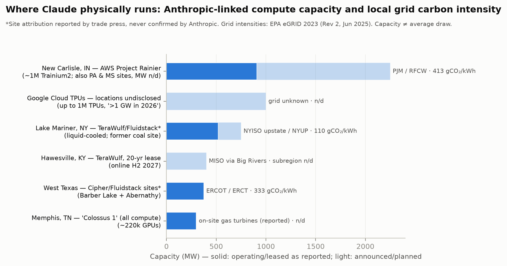

# Provenance

Where every number in the dashboard comes from, how far to trust it, and what is still unknown.

Compiled 11 August 2026, revised 14 August 2026. Prepared by Josh Issa.

---

## 1. The one thing to understand first

**The token counts are measured. Everything else is derived.**

Claude Code writes a transcript for every session, and each assistant message carries the token
counters the serving stack returned: fresh input, cache writes, cache reads, output. Those four
numbers are ground truth. `measure_usage.py` reads them and nothing else — never message content.

Every figure below them — energy, CO₂, water — is that measurement multiplied by a rate somebody
else estimated. The rates are the weak link, and they are weak for one reason.

## 2. Why third-party rates at all

**Anthropic has published no first-party environmental data of any kind.** No sustainability
report, no Scope 1/2/3 inventory, no per-query energy, water or carbon figure, no PUE or WUE, no
training disclosure for any model. Verified directly on 11 August 2026: `anthropic.com/sustainability`
returns 404, and the Transparency Hub carries no environmental content. Corroborated by the SINK
Project scorecard (31/100, 42nd of 43 SaaS companies assessed), Stanford FMTI, MIT Technology
Review and Heatmap.

Competitors have published. Google released a measured production figure for Gemini (median text
prompt 0.24 Wh, 0.03 gCO₂e, 0.26 mL water, August 2025). Mistral published a full peer-reviewed
lifecycle analysis. Meta disclosed GPU-hours and location-based emissions for Llama 3.1. Anthropic
has published demand-side advocacy instead: *Build AI in America* (July 2025) projects ~2 GW of
its own data centres in 2027 and ~5 GW in 2028, and the February 2026 electricity-price pledge
contains no renewables percentage, carbon target or quantified metric of any kind.

So there is no authoritative rate to use, and every number this project produces is an estimate
made by someone outside the company. That is not a caveat at the end; it is the reason the
uncertainty bands in the dashboard are as wide as they are.

## 3. Energy: tokens to kilowatt-hours

| Rate | Value | Source |
|:---|---:|:---|
| Fresh input | 390 Wh / M tokens | Couch, *Electricity use of AI coding agents*, Jan 2026 |
| Output | 1,950 Wh / M tokens | same |
| Cached read | 39 Wh / M tokens | same |

Couch anchors on Epoch AI's first-principles GPT-4o estimate and scales by Anthropic's published
API price ratios, on the stated and testable assumption that price tracks marginal compute. The
result is validated against 8,825 logged API calls. It is the most transparent Claude-specific
estimate available, and it is still a napkin model.

**Uncertainty: 2–4×.** The dashboard draws ×/÷2, the low end of that range, as a band on both the
daily and the cumulative curve. It is multiplicative, so it compounds into the total rather than
averaging out across days — sixty days of measurements sharing one uncertain rate are no more
certain than one day.

Why the spread is that wide is visible across the published literature, which disagrees by two
orders of magnitude for comparable models:

Most of that spread is *method and boundary*, not real differences between models. Three
methodologically independent results converge for a median short query on a frontier model:
Google's measured 0.24 Wh, Epoch's modelled ~0.3 Wh for GPT-4o, and Microsoft/Oviedo's
production-grounded simulation at 0.31 Wh (IQR 0.16–0.60, *Joule* 2026). The only academic
benchmark covering Claude — Jegham et al., arXiv:2505.09598 v6 — sits far higher at 0.84–17 Wh,
using API latency mapped onto assumed NVIDIA DGX nodes. That hardware assumption is wrong in kind
for Anthropic, which serves heavily on AWS Trainium and Google TPUs, so its values are best read
as upper-bound-flavoured relative rankings.

**A boundary ratio worth carrying everywhere:** Google's same median prompt costs 0.10 Wh counting
active accelerators only, and 0.24 Wh including host, idle machines and PUE. Apply that 2.4× ratio
whenever a chip-only academic figure is compared with a production one.

### Why cached reads dominate

Energy scales roughly linearly with output tokens, stays near-flat with input at short context,
and turns supra-linear at long context (Fernandez et al., ACL 2025; Epoch's modelled GPT-4o curve
reaches ~2.5 Wh at 10k input tokens and ~40 Wh at 100k).

In practice this means an accumulating conversation is re-read on every turn. Measured across
103 real sessions, **96.8% of all tokens processed were cached reads**, and even at one-tenth the
per-token rate they account for **67% of total energy**. The least-certain of the three rates
therefore drives the headline. If Couch's cached-read figure is wrong, the total is wrong by
almost the same factor.

## 4. Carbon: kilowatt-hours to CO₂

The dashboard offers fifteen conventions because there is no single correct one. They answer three
different questions.

| Convention | Question it answers | Source |
|:---|:---|:---|
| **eGRID annual average** | What is this usage's share of the grid it ran on? | EPA eGRID 2023 Rev 2 |
| **AVERT short-run marginal** | What did the grid burn *tonight* because of it? | EPA AVERT, April 2024 release, data year 2023, "uniform EE" flat profile |
| **NREL Cambium long-run marginal** | What gets *built* because demand like this persists? | Cambium 2023, 20-year levelized, 3% real discount, mid-case |

Verified eGRID values, checked against EPA summary data: US average 348 gCO₂/kWh (767.209 lb/MWh),
RFCW 413, ERCT 333, NYUP 110.

### The siting finding

Applied to the three grids hosting most documented Anthropic capacity:

| Site | eGRID average | AVERT short-run | Cambium long-run (20 yr) |
|:---|---:|---:|---:|
| New Carlisle, IN | 413 | 618 | **166** |
| Barber Lake / Abernathy, TX | 333 | 587 | **114** |
| Lake Mariner, NY | 110 | 475 | **124** |
| *spread across the three* | *3.75×* | *1.30×* | *1.46×* |

Two results follow, and the first holds precisely because the two marginal conventions are biased
in opposite directions on level. **The siting spread compresses under both**: a factor of 3.75 on
annual averages becomes 1.30× short-run and 1.46× long-run. And **the ranking inverts** — on the
20-year basis appropriate to a multi-decade campus, Texas is cleanest and upstate New York is not,
because sustained new load in ERCOT and PJM_West induces build far cleaner than those grids run
today (0.34× and 0.40× of their averages) while in New York it induces build no cleaner than the
hydro and nuclear already there (1.13×). What matters for incremental load is clean *headroom*,
which a clean grid does not guarantee.

Which convention is appropriate is not a matter of taste. NREL advises applying long-run rates to
interventions persisting five years or more; EPA's AVERT documentation states its rates "should not
be used to examine the emission impacts of changes that extend more than 5 years into the future."

### Cautions, unresolved

- AVERT and Cambium regions are **not coextensive with eGRID subregions**, so every
  marginal-versus-average ratio crosses a boundary. Worst for New York, where both marginal
  datasets span all of NYISO while eGRID's NYUP is upstate only.
- AVERT assumes a **0.5% displacement of regional demand**, which a multi-gigawatt campus badly
  violates. This is the largest single stretch in the table.
- EPA states AVERT "is a marginal emissions assessment tool and not a tool for emissions
  accounting" and cautions against its use in corporate greenhouse-gas reporting.
- Both marginal datasets include distribution losses, so they run modestly high for a
  transmission-connected site. Cambium's values are one of eight published scenarios.
- **PJM's own last published short-run rate disagrees with AVERT by a third** for a broadly similar
  footprint: 1,007 lb/MWh flat-weighted for 2022, or 457 gCO₂/kWh, against AVERT's 618. That
  disagreement is carried as an error bar rather than resolved, because two authoritative sources
  differing by a third *is* the state of public knowledge. PJM discontinued the series after the
  2018–2022 edition.

## 5. Water

| Factor | Value | Source |
|:---|---:|:---|
| On-site cooling (WUE) | 0.18 L / kWh | AWS multiplier used by Jegham et al. v6 |
| Off-site, power-plant evaporation | 3.142 L / kWh | same |

The dashboard shows these stacked rather than summed, because **the split is a measurement
boundary, not an error bar**, and it is the entire reason published water figures disagree by a
factor of ~170. Google's 0.26 mL per prompt is on-site cooling only. Mistral's 45 mL per 400-token
response includes power-plant evaporation on the French grid mix. Both are correct under their own
definitions.

The viral "a bottle of water per prompt" claim originates with Li et al. 2023, which said 500 mL
per *10–50 responses* including off-site water. The same UC Riverside group revised to ~15 mL total
(~5 mL on-site) for a GPT-4-class prompt in July 2026.

For Claude specifically there is **no measured water figure at all**. New Carlisle's actual water
use is NDA-protected, with a permitted seasonal discharge ceiling of 1.58 MGD in Phase 1 and an
air-cooled design that minimises routine draw. No other Anthropic site publishes water data.
Chip-fabrication water (~2,200 gallons of ultra-pure water per microchip, Ren) is unquantified
fleet-wide for every provider.

## 6. Everyday equivalents

The dashboard's equivalents toggle uses published factors. The framing follows Arbor's
carbon-equivalent calculator, which publishes its categories but not most of its factors, so the
numbers come from primary sources instead.

| Equivalent | Factor | Source |
|:---|---:|:---|
| Miles driven | 3.93×10⁻⁴ t CO₂e / mile | EPA Greenhouse Gas Equivalencies |
| Gasoline | 8.887×10⁻³ t CO₂ / US gallon | EPA |
| Smartphone charges | 1.24×10⁻⁵ t CO₂ / charge | EPA |
| Tree seedlings, 10 years | 0.060 t CO₂ each | EPA |
| Home electricity, one year | 4.798 t CO₂ | EPA |
| Long-haul flight | 0.11704 kg CO₂e / passenger-km | UK DESNZ/DEFRA 2025, economy |
| Shower | 60.6 L | **derived**: EPA WaterSense 2.0 gpm × 8 min |
| Toilet flush | 6.06 L | US Energy Policy Act 1992 standard |
| Household-day of electricity | 29.6 kWh | EIA |
| EV distance | 0.17 kWh / km | **assumed** |

Two entries are flagged because they are not wholly sourced. EPA publishes the showerhead *flow
rate*, not a duration — the 8-minute shower is this project's assumption. The EV figure is a
plausible round number, not a citation. DEFRA's long-haul factor rises to 0.15282 kg CO₂e/passenger-km
if radiative forcing is included; the dashboard uses the lower, more conservative value.

## 7. Training

Not in the dashboard, because it cannot be attributed to a user's session, but it bounds the
question of whether inference is the right thing to measure at all.

**Nothing is disclosed for any Claude model.** The nearest anchors are Epoch AI's compute
estimates — Claude 3 Opus ≈ 1.6×10²⁵ FLOP, 3.5 Sonnet ≈ 2.7×10²⁵, 3.7 Sonnet ≈ 3.4×10²⁵ — and
`training_bounds.py`, which converts them using an intensity calibrated against the one modern run
where the developer disclosed both compute and GPU-hours.

Meta disclosed 3.8×10²⁵ FLOP and 30.84M H100-hours for Llama 3.1 405B. At the H100's 700 W TDP
that is 21.6 GWh, implying **5.68×10⁻¹⁶ Wh per FLOP** and a model FLOP utilization of 34.6%,
comfortably inside the 25–50% band the literature supports. The calibration survives an independent
check: Meta's separately disclosed 8,930 tCO₂e divided by that energy backs out 414 gCO₂/kWh, a
plausible US industrial grid factor.

| Model | Epoch FLOP | Derived GWh at the wall |
|:---|---:|---:|
| Claude 3 Opus | 1.6×10²⁵ | 7.2 – **10.4** – 14.3 |
| Claude 3.5 Sonnet | 2.7×10²⁵ | 12.1 – **17.5** – 24.2 |
| Claude 3.7 Sonnet | 3.4×10²⁵ | 15.2 – **22.0** – 30.5 |
| 3.7 Sonnet on Epoch's own FLOP range | 1.1×10²⁵–1.0×10²⁶ | 4.9 – 89.6 |

**Everything in this table is derived, not published.** The dominant uncertainty is the input, not
the conversion: Epoch flags its Claude figures as low-precision, and its stated range for 3.7
Sonnet spans a factor of 9, which swamps both the 2.0× conversion band and the ~4× spread across
grid conventions. Excluded and pushing the true figure up: host CPU and memory, networking,
storage, failed experimental runs, post-training compute, embodied hardware emissions.

For scale, the Claude 3 Opus central figure is about **eleven hours of the New Carlisle campus
running at its observed 910 MW** — half a day of one site. That is why lifetime inference, not
training, dominates a deployed model's footprint.

## 8. What is still unknown

- **No measured long-context energy curve exists for any Claude model**, despite the 200k–1M
  context window being the signature feature and the biggest term in agentic use.
- **Prompt caching's real energy effect is unmeasured.** Couch prices it at ~1/10 fresh input;
  nobody has measured it. It is 67% of the energy in this dataset.
- **No marginal water-intensity factors are published.** A marginal gas unit evaporates cooling
  water and wind does not, so the off-site water figure inherits the same dispatch uncertainty as
  carbon, unquantified.
- **Anthropic's utilization, training/inference split, and per-site grid mix are all undisclosed**,
  so company-level aggregates are estimable only to a factor of a few.

The disclosure set that would make all of this computable has precedent at every point: a
Gemini-style measured per-prompt distribution with stated boundary, training energy and
location-based emissions per model on Meta's precedent, fleet PUE and WUE per site as AWS and
Google publish, a Scope 1/2/3 inventory standard for Anthropic's peers, and site water
consumption. Anthropic's 2026 hires in energy accounting and non-financial reporting suggest these
numbers exist internally.

## 9. Sources

**Rates and measurements.** Couch, *Electricity use of AI coding agents* (simonpcouch.com, Jan
2026) · Jegham et al., *How Hungry is AI?*, arXiv:2505.09598 v6 · Elsworth et al. (Google),
arXiv:2508.15734 · Oviedo et al. (Microsoft), *Joule* 2026, arXiv:2509.20241 · Epoch AI gradient
updates · Fernandez et al., ACL 2025 · Chung et al. (ML.ENERGY), NeurIPS 2025, arXiv:2505.06371 ·
Mistral LCA with Carbone 4 / ADEME (Jul 2025) · Luccioni et al. (BLOOM), JMLR 2023 · Patterson et
al. 2021, arXiv:2104.10350 · Meta Llama 3.1 model card.

**Grid and equivalence factors.** EPA eGRID 2023 Rev 2 · EPA *Emission Rates from AVERT*, April
2024 release · EPA AVERT region/state apportionment · NREL, *Long-Run Marginal Emission Rates for
Electricity — Workbooks for 2023 Cambium Data* (Feb 2024) · PJM, *2018–2022 CO₂, SO₂ and NOₓ
Emission Rates* (Apr 2023), the final edition · EPA Greenhouse Gas Equivalencies Calculator ·
UK DESNZ/DEFRA 2025 conversion factors · EPA WaterSense · Gagnon & Cole, *PNAS* 2022 · Holland,
Kotchen et al., *PNAS* 2022.

**Disclosure and discourse.** Anthropic, *Build AI in America* (Jul 2025) and the electricity-price
pledge (Feb 2026) · SINK Project · Stanford FMTI · MIT Technology Review (May 2025) · Heatmap
(2026) · Luccioni, Strubell & Crawford, FAccT 2025, arXiv:2501.16548 · Luccioni et al.,
*Misinformation by Omission*, arXiv:2506.15572 · Li et al., arXiv:2304.03271 · de Vries-Gao,
*Joule* 2025 · IEA, *Energy and AI* (2025).

**Machine-readable.** Every value above, with its source, method and credibility flag, is in
`data/sourced_data.json`. The scripts that derive from it are `measure_usage.py`,
`training_bounds.py`, `extract_avert.py`, `extract_cambium.py` and `make_figures.py`.

---

*A fuller treatment — a claims audit of viral and corporate figures, the aggregate-consumption
literature, and a section-by-section review of what the academic record does and does not
establish — existed as a 28-page report and a 16-page companion brief. Both were retired on
14 August 2026 once the dashboard replaced their hypothetical session with real measurement. They
remain in git history at commit `3d7008a` for anyone who wants the long version.*
