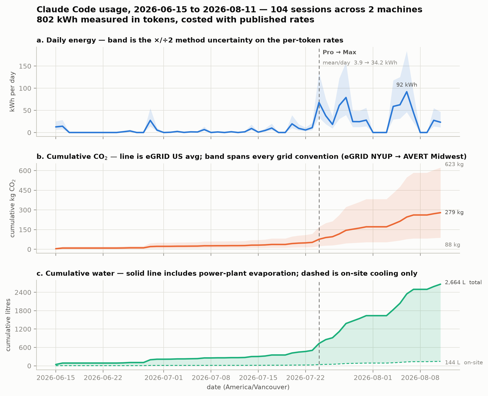

# Environment Cost of Claude

A dashboard that measures **your own** Claude Code usage across every machine you work on and
costs it in energy, CO₂ and water — plus the report that documents where every conversion factor
comes from.



## Run the dashboard

```bash
make dashboard          # or: python3 dashboard.py, or double-click Dashboard.command
```

It opens `http://localhost:8765` with three tabs and a **Refresh data** button that re-runs
collection on demand:

| Tab | Shows |
|:---|:---|
| **Environmental cost** | Energy, CO₂ and water with a live chart — daily value, running total, and the ×/÷2 rate-uncertainty band. Switchable between real units and everyday equivalents (km driven, long-haul flights, showers). Water splits into on-site cooling and power-plant evaporation. Any of 15 grid accounting conventions. |
| **Sources** | How much came from each machine, with the transcript roots it read. |
| **Projects** | Every project taking 5% or more of the total, and the directory it lives in. |
| **Habits** | When you work by day and hour, total tokens processed, session lengths, and how often context compaction fires and at what size. |

Stdlib Python only — no install step, no dependencies, works anywhere `python3` runs.

### Telling it where you work

Claude Code keeps transcripts per machine with **no central ledger**, so one machine is usually a
large undercount. Copy `sources.example.json` to `sources.json` and list the hosts you use:

```json
{ "remote": ["cluster", "other-box"] }
```

**To find out what to name**, ask the tool — it lists every working directory it found, largest
first, already formatted as a labels block:

```bash
python3 measure_usage.py --list-projects
```

You can also give machines and projects real names instead of hostnames and paths:

```json
{
  "remote": ["cluster"],
  "labels": {
    "login*.cluster.edu":      "Cluster",
    "/scratch/*/mesa-*":       "ATS",
    "/Users/me/code/thing*":   "Thing"
  }
}
```

Patterns are globs, not exact strings, because cluster login nodes and laptop hostnames change
between sessions — matching `login06` exactly would split one machine into a new row every
time you log in. The longest matching pattern wins, so a specific rule beats a general one, and
the real host or path stays visible underneath the label.

Local is always included. Remote hosts are read over SSH — they need only `python3`, since the
collector is piped to them over stdin. Transcript roots are auto-discovered and **scoped to
`$USER`**, because a wildcard over `/scratch/*` matches other people's directories on a shared
cluster. Only token counts come back. No message content is read, and nothing leaves your machines.

Cloud sessions are never written to local disk and cannot be collected at all.

## What it reads, and what it exposes

`measure_usage.py` opens transcript files and reads exactly five things per record: the timestamp,
the working directory, the record type, the compaction metadata, and the four token counters on
assistant messages. **It never reads message content** — not prompts, not responses, not tool
output. You can verify that in one grep: the only fields it touches are `timestamp`, `cwd`,
`type`, `compactMetadata` and `message.usage`.

Nothing is uploaded anywhere. The only outbound network calls in the repo are in
`extract_avert.py` and `extract_cambium.py`, which *download* public spreadsheets from EPA and
NREL. Remote collection runs over your own SSH and returns token counts only.

The dashboard binds to `127.0.0.1` and serves exactly three endpoints — the page itself and two
JSON APIs. It will not hand out any other file in the directory, and it rejects requests whose
`Host` header is not loopback, which blocks a hostile web page from reaching it by resolving its
own domain to `127.0.0.1`.

Two files stay on your disk and out of git: `sources.json` (your machine names) and
`data/usage_cache.json` (every directory you have worked in). Both are in `.gitignore`. If you
fork this repo, check they are still ignored before pushing.

## What is measured and what is not

The **token counts are measured** — Claude Code records what the serving stack returned for every
assistant message. Everything downstream is **derived**: energy comes from published per-token
rates carrying 2–4× method uncertainty, and CO₂ depends on which grid accounting convention you
pick, which alone spans a factor of about seven.

The dashboard shows that spread rather than hiding it behind one number. Why those particular
rates and factors, and how much to trust each, is what the report is for.

## Provenance

Every rate, grid factor and equivalence the dashboard applies is documented in
**[`PROVENANCE.md`](PROVENANCE.md)**: where it came from, how far to trust it, and what is still
unknown. `make provenance` builds it as a PDF if you want one for citation.

The short version is that Anthropic has published no first-party environmental data of any kind, so
every rate here is somebody else's estimate. That is why the dashboard shows bands rather than
single numbers.

## License

Software is MIT. The written work, figures and data are CC BY 4.0. Use any of it for any purpose,
with attribution. See `LICENSE`.

## Rebuild

```bash
make dashboard    # local dashboard on http://localhost:8765
make figures      # regenerate the sourced figures from data/sourced_data.json
make provenance   # build PROVENANCE.md as a PDF (needs pandoc + xelatex)
```

Scripts use paths relative to the project root — **run everything from here**, not from `figures/`.

## Dependencies

**Python** (3.9+): `matplotlib` for the figures. `extract_avert.py` additionally needs `openpyxl`,
but only if you want to re-derive the EPA AVERT marginal-emissions rates — the extracted values are
already in `data/sourced_data.json`, so nothing in `make` depends on it.

```bash
pip install matplotlib
python3 -m venv .venv && .venv/bin/pip install openpyxl   # only for extract_avert.py
```

**PDF toolchain**: pandoc with a XeLaTeX engine.

```bash
# Debian / Ubuntu
sudo apt-get install -y pandoc texlive-xetex texlive-latex-recommended \
                        texlive-fonts-recommended lmodern

# macOS (Homebrew)
brew install pandoc
brew install --cask mactex-no-gui     # or basictex + `sudo tlmgr install lmodern`
```

`lmodern` is the one that bites — pandoc's default template requires it and a minimal texlive
install omits it. The documents set DejaVu Sans as the main font; substitute in the YAML front
matter if you don't have it.

## Layout

```
├── PROVENANCE.md                # where every number comes from
├── data/sourced_data.json       # every plotted value + its source and credibility flag
├── data/avert_emission_rates_2023.xlsx   # EPA primary source, archived (sources move)
├── make_figures.py              # the five sourced figures
├── extract_avert.py             # re-derives AVERT marginal rates from the EPA workbook
├── training_bounds.py           # derived training-energy bounds behind PROVENANCE §7
├── extract_cambium.py           # re-derives NREL Cambium long-run marginal rates
├── dashboard.py                 # local dashboard server (stdlib only)
├── dashboard.html               # the four tabs
├── favicon.svg                  # tab icon; regenerate with make_favicon.py
├── make_favicon.py              # generates favicon.svg and inlines it as a data URI
├── Dashboard.command            # double-click launcher (macOS)
├── sources.example.json         # copy to sources.json and list your machines
├── measure_usage.py             # your own Claude Code usage -> tokens, energy, CO2, water
├── collect_usage.sh             # merges usage across machines (local + ssh hosts)
├── figures/*.png                # generated (fig_s2_usage_alltime.png needs the author's
│                                #   own transcripts — `make` cannot rebuild it)
├── CLAUDE.md                    # project conventions
└── HANDOFF.md                   # state, decisions, open threads
```

## Command line, without the dashboard

`measure_usage.py` reads the token counters Claude Code writes to `~/.claude/projects/*/*.jsonl`
and carries them through to CO2 and water. It opens only the usage counters, never message
content, and nothing leaves the machine.

```bash
python3 measure_usage.py                  # everything, US-average grid
python3 measure_usage.py --days 30        # last 30 days
python3 measure_usage.py --grid Cambium_PJM_West   # a specific accounting convention
python3 measure_usage.py --list-grids     # all 15 conventions, cheapest first
```

The token counts are measured. Everything downstream — energy, CO2, water — is derived from
third-party rates carrying 2–4× method uncertainty, and the spread across accounting conventions
alone is ~7×. The tool prints all of them rather than one number, for the reasons in Section 4 of
the brief.

**One run sees one machine, and that is usually a large undercount.** Claude Code keeps
transcripts per-machine with no central ledger. For this author, a laptop-only run missed 62% of
the total, which lived on an HPC login node. Use the collector:

```bash
./collect_usage.sh                    # this machine only
./collect_usage.sh cluster           # this machine + a remote host
./collect_usage.sh cluster other-box # ...and more
```

Remote hosts need nothing but `python3` — the script is piped over stdin and run with `--raw`,
which applies no rates and reads no data files. Only token counts come back, never message
content. Remote roots are auto-discovered and **scoped to `$USER`**: a wildcard like
`/scratch/*/.claude/projects` matches other people's directories on a shared cluster, which both
inflates your total and reads what isn't yours.

Two things stay uncounted regardless: cloud sessions (server-side, never written to local disk)
and Claude Desktop / claude.ai. There is no way to recover those from a filesystem.

### Cost over time

Transcripts timestamp every record in **UTC**, whatever timezone the host runs in, so a laptop on
Pacific and a cluster on Eastern are already on one clock. The timezone is purely a display choice,
applied when the bins are drawn:

```bash
python3 measure_usage.py --by day  --tz America/Vancouver   # calendar days, gaps preserved
python3 measure_usage.py --by hour --tz America/Vancouver   # hour-of-day profile
python3 measure_usage.py --by dow                           # day-of-week profile
python3 measure_usage.py --by week   # or --by month
```

`--by` works with `--merge` too, so multi-machine history bins on a single wall clock.

For an all-time figure — daily energy and cumulative CO2, each with its uncertainty band, plus
annotated events:

```bash
python3 measure_usage.py --plot figures/usage.png --tz America/Vancouver \
        --event 2026-07-24='Pro -> Max'
```

The daily band is the ×/÷2 method uncertainty on the per-token rates; the cumulative band spans
every grid convention in `sourced_data.json`. `--event` is repeatable and prints the mean-per-day
on either side of each marker.

## A note on the numbers

Anthropic publishes no environmental data, so nothing here about Claude is measured — it is all
third-party estimation with method-level uncertainty of roughly 2–4× per point, and up to an order
of magnitude in total for the session scenario. Both documents are written to make that explicit
rather than to hide it. Please preserve that when editing; see the honesty rule in `CLAUDE.md`.
