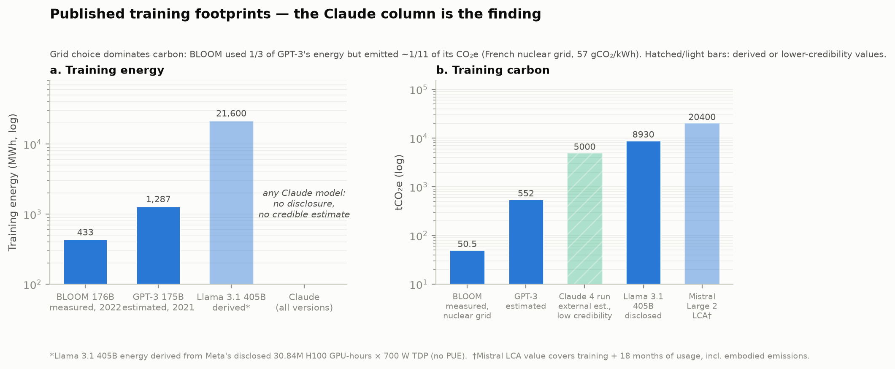
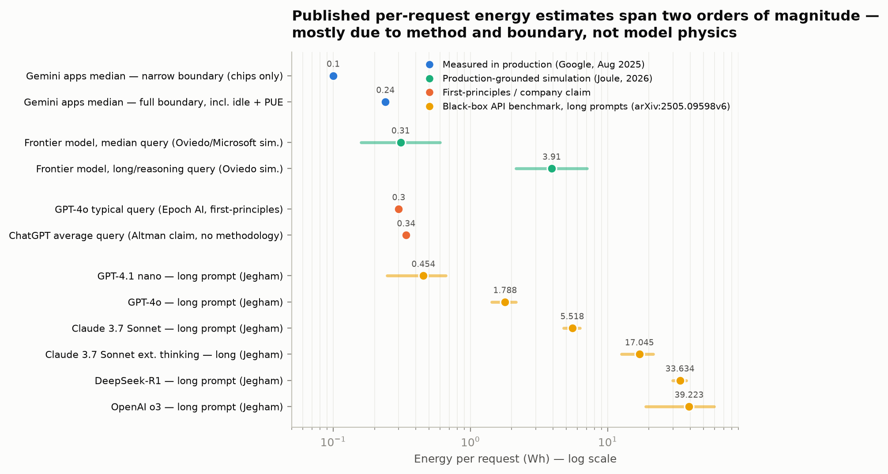
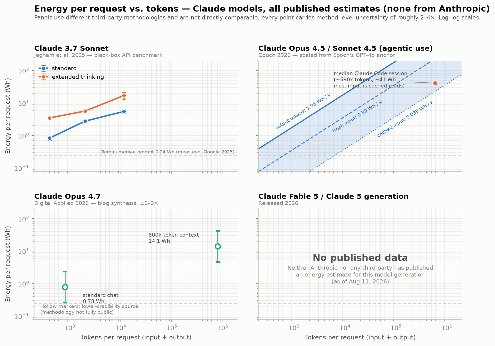
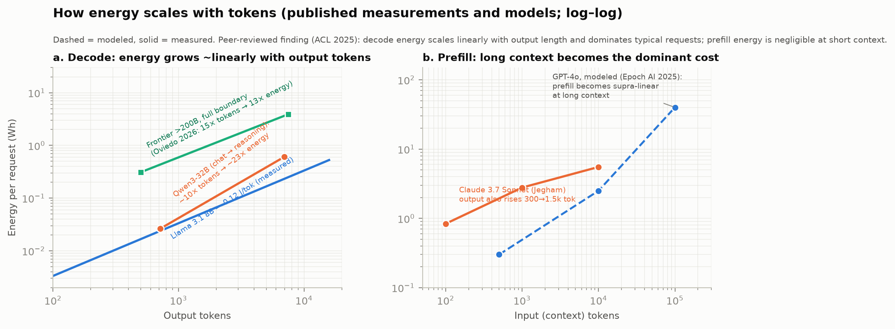

\newpage

# Executive summary {.unnumbered}

This report asks a narrow question with a complicated answer: what can be quantified, from real published sources, about the environmental impact of using Anthropic's Claude models? The analysis draws on four parallel research sweeps conducted on August 11, 2026, covering Anthropic's own publications, the peer-reviewed and preprint literature, third-party estimates specific to Claude, and the public discourse including its misinformation. Every number that carries weight is traced to a primary source where possible.

The single most consequential finding is an absence. **Anthropic has published no first-party environmental data of any kind.** There is no sustainability report, no Scope 1/2/3 emissions inventory, no per-query energy, water, or carbon figure, no power usage effectiveness (PUE) value, and no training-run disclosure for any Claude model. The company's `/sustainability` URL returns a 404, and its Transparency Hub contains no environmental content. This contrasts with Google, which published a measured production figure for Gemini (median text prompt: 0.24 Wh, 0.03 gCO~2~e, 0.26 mL water, August 2025), with OpenAI, whose CEO stated 0.34 Wh per average ChatGPT query without methodology, and with Mistral, which published a full peer-reviewed lifecycle analysis. Independent scorecards rank Anthropic 42nd of 43 SaaS companies assessed on environmental transparency. Everything quantitative in this report about Claude specifically therefore comes from third parties, and the credibility of each estimate is assessed individually.

Within that constraint, a great deal can still be established. The best available per-request estimates for Claude models span roughly **0.8 Wh (short chat, Claude 3.7 Sonnet) to about 17 Wh (long-context extended-thinking requests)**, from the only academic benchmark to cover Claude. Its method, API latency mapped onto assumed NVIDIA hardware, is contested and probably biased high, since measured and simulated figures for comparable frontier models cluster around 0.24–0.6 Wh for a median query. Energy per request scales approximately **linearly with output tokens** (the peer-reviewed consensus), stays nearly flat with input tokens at short context, and becomes **supra-linear in input tokens at long context**, where a modeled 100,000-token prompt reaches ~40 Wh. Reasoning and agentic workloads multiply footprints through token inflation rather than different physics. A median Claude Code session (~590k tokens) is estimated at ~41 Wh, roughly 170 "median Gemini prompts."

The physical geography of Claude is now substantially documentable, and it matters, because grid carbon intensity varies by a factor of ~3.8 across Anthropic's sites on annual-average accounting — though only ~1.3–1.5× on the marginal accounting appropriate to *incremental* load, a distinction that weakens the case for clean-grid siting considerably and, on the 20-year horizon these campuses actually occupy, reverses which site is cleanest. The flagship AWS "Project Rainier" campus in New Carlisle, Indiana (910 MW observed in March 2026, building toward ~2.25 GW) sits on the PJM grid at ~413 gCO~2~/kWh, while the probable Fluidstack/TeraWulf site in upstate New York sits at ~110 gCO~2~/kWh, and a reported Memphis arrangement runs on on-site gas turbines. Training footprints for Claude are entirely undisclosed. The only anchors are other labs' disclosures (Llama 3.1 at 8,930 tCO~2~e location-based) and third-party FLOP estimates.

Finally, the discourse audit finds errors in both directions: the viral "bottle of water per prompt" claim is off by one to two orders of magnitude (its own originating group has revised toward ~15 mL per prompt including off-site water), while corporate per-prompt figures understate impact through narrow boundaries: medians rather than means, on-site-only water, market-based carbon accounting, and the exclusion of training, embodied hardware, and the fast-growing long-context and agentic workloads. The honest quantitative summary is that an individual short Claude chat is a small quantity of energy, on the order of a fraction of a watt-hour to a few watt-hours. Heavy agentic use is hundreds to thousands of times larger per user, aggregate impact is driven by multi-gigawatt buildout on largely fossil-heavy grids, and the precision the public debate demands is currently impossible for Claude because the company that has the measurements has not published them.

\newpage

# Introduction: the question, and why it resists a clean answer

The critique that large language models carry an unacceptable environmental cost is pervasive, and so is the counter-claim that a chatbot query is trivially cheap. Both positions circulate with numbers attached, and many of those numbers are wrong, outdated, or quietly incomparable. The purpose of this report is to establish, for Anthropic's Claude models specifically, what is actually quantifiable from published evidence as of August 11, 2026, and to be explicit about what is not.

The user's framing for this project included five starting intuitions: that impact is complex and locally mediated through data-center siting and cooling; that training and inference are distinct cost centers; that per-prompt impact scales with tokens; that aggregate use, not individual use, dominates; and that the information environment is polluted. Each intuition is tested against sources in the sections that follow, and each turns out to be substantially correct, with quantitative refinements that change how the story should be told.

A ground rule adopted throughout, at the user's direction, is **strictness**: only published, sourced values appear in tables and figures. Where a model generation has no published estimate (notably the Claude Fable 5 / Claude 5 generation), the gap is displayed as a finding rather than papered over with extrapolation. Where this report performs arithmetic on sourced inputs (unit conversions, per-token divisions), the derivation is stated inline and labeled as such. One section departs from this. **Appendix C** constructs bottom-up bounds on Claude training energy from published FLOP estimates, because the alternative, leaving a reader with no sense of scale at all, serves them worse. It is quarantined in the appendix, every value is marked derived, and it feeds nothing in the body or the figures. A provenance note. This report was researched and compiled using Claude itself. All sources cited were retrieved and cross-checked during the research session, and the reader can verify every claim against the linked originals in Appendix B.

## Definitions and measurement boundaries

Nothing in this literature can be interpreted without attention to *boundaries* — what a number includes. Four distinctions do most of the work.

**Energy vs. carbon vs. water.** Electricity consumption (watt-hours, Wh) is the physical quantity closest to measurement. Carbon (gCO~2~e) is energy multiplied by a grid carbon-intensity factor that varies by roughly 8× across Anthropic-relevant grids, from 57 gCO~2~/kWh for the French nuclear grid used to train BLOOM to ~413 gCO~2~/kWh for the PJM subregion serving Project Rainier. Water divides into **on-site** water, evaporated in data-center cooling and measured by water usage effectiveness (WUE), and **off-site** water, evaporated at the power plants generating the electricity. The off-site term is typically 10–20× larger and is the main reason published water figures disagree by a factor of ~170.

**Chip-only vs. full-system vs. full-boundary.** A GPU's energy is only part of the story: host CPUs and memory, networking, storage, *idle provisioned capacity*, and data-center overhead (PUE) sit on top. Google's Gemini paper is unusually explicit here. The same median prompt costs **0.10 Wh counting active accelerators only, and 0.24 Wh at the full boundary** including host, idle machines, and PUE. That 2.4× ratio should be applied whenever a chip-only academic measurement is compared to a production figure. Beyond that sit training amortization, failed experimental runs, and embodied emissions from chip fabrication and construction, which only Mistral's LCA has seriously attempted to include.

**Median vs. mean vs. distribution.** Corporate per-prompt figures are medians. Energy-per-request distributions are heavy-tailed, since long-context and reasoning requests cost 10–100× the median. The mean is therefore materially higher than the median, and no provider has published the distribution.

**Market-based vs. location-based carbon.** Market-based accounting nets purchased renewable certificates and PPAs against consumption, giving Google's 0.03 g/prompt and Meta's "0 tCO~2~e" for Llama training. Location-based accounting uses the physical grid mix, giving 11,390 tCO~2~e for Llama 3.1. Critics, including Luccioni et al., argue location-based should be mandatory for AI disclosure. For a company like Anthropic with **zero announced clean-power purchase agreements** (per Heatmap's June 2026 analysis), the two accountings currently coincide, because there is nothing to net.

## Source hierarchy

The report weighs sources in this order: (1) primary corporate disclosures and regulatory filings, (2) peer-reviewed measurements, (3) credible preprints and technical reports with published methodology such as Epoch AI, ML.ENERGY and Microsoft/Oviedo, (4) trade-press reporting of verifiable facts such as capacity, leases and grid interconnections, (5) transparent independent estimates such as Couch, and (6) blog syntheses and aggregators, used only when flagged. Untraceable figures that circulate widely (for example, "Claude 3 Opus = 4.05 Wh/query") are documented in the claims audit but excluded from figures.

# The disclosure baseline: what Anthropic says, and what it doesn't

## Verified absences

The following absences were verified directly against Anthropic's own web properties during this research session, and corroborated by independent trackers:

Table: Anthropic's environmental disclosure status, August 2026.

| Item | Status | Verification |
|:---|:---|:---|
| Sustainability / environment page | **None** — `anthropic.com/sustainability` returns 404 | Direct fetch, 2026-08-11 |
| Transparency Hub environmental content | **None** — sections cover model reports, system trust, voluntary commitments only | Direct fetch (updated 2026-07-23) |
| Scope 1/2/3 emissions inventory | **Never published** | SINK Project; Tunley Environmental; Heatmap |
| Per-query energy / water / carbon figure | **Never published** | Multiple independent trackers |
| PUE / WUE for dedicated capacity | **Never published** | SINK Project; Heatmap |
| Training energy or emissions, any model | **Never published** | Stanford FMTI; literature search |
| Clean-power purchase agreements | **Zero announced** to date | Heatmap (2026) |
| Sustainability report | **None** | SINK Project scorecard |

The SINK Project scorecard rates Anthropic **31/100, 42nd of 43** SaaS companies assessed (OpenAI ranks 43rd at 25/100; Google and Microsoft rank 1st–2nd), noting that the company "explicitly refused broader environmental disclosure." Simon Willison, a generally sympathetic commentator, has repeatedly criticized the Claude system cards' carbon language as "weak sauce, show us the numbers!" MIT Technology Review's May 2025 investigation placed Anthropic among the closed providers whose inference footprint is "a total black box," while noting the company was simultaneously telling the White House the US should build 50 GW of AI power capacity.

## What Anthropic *has* published

Anthropic's public posture on energy is demand-side advocacy rather than footprint disclosure. Three primary documents matter. **"Build AI in America"** (July 21, 2025) projects Anthropic alone operating ~2 GW of data centers in 2027 and ~5 GW in 2028, and calls for at least 50 GW of US AI capacity by 2028 sourced from "all of the above", meaning next-generation geothermal, advanced nuclear, *and natural gas*. The **electricity-price pledge** (February 11, 2026) is a four-part commitment to pay grid-upgrade costs, match demand with new generation, invest in grid-optimization tools, and fund community measures including "water-efficient cooling technologies", and it contains no renewables percentage, carbon target, or quantified metric of any kind. The **Frontier carbon-removal coalition** membership (June 17, 2026) makes Anthropic the first pure-AI company in the $915M advance-market commitment, with its individual dollar contribution undisclosed and no accompanying emissions baseline against which removal could be netted.

Dario Amodei's public writing treats the environment as a problem AI will help solve, since "Machines of Loving Grace" mentions carbon removal and clean-energy technology as AI-accelerated fields, rather than as a cost of AI to be accounted. In 2026 Anthropic hired several senior energy-strategy staff from DOE, Google's data-center clean-energy team and Meta's energy-sourcing team, and per Heatmap is recruiting a head of non-financial reporting. Those signal that first-party disclosure may eventually arrive, but as of this writing nothing has.

**Every per-model number in this report is therefore a third-party estimate**, and the highest-credibility calibration points come from Anthropic's competitors.

# Where Claude physically runs

The user's first intuition — that impact is mediated by where data centers sit and how they are cooled — is strongly supported. Anthropic's compute is multi-cloud and expanding on the order of tens of billions of dollars per year. The documented sites, with capacity and grid data, are summarized in Figure 1 and Table 2.

Table: Documented Anthropic-linked compute sites, August 2026. "n/d" = not disclosed.

| Site | Partner / deal | Scale | Grid & carbon intensity | Cooling / water |
|:---|:---|:---|:---|:---|
| New Carlisle, IN (+ PA, MS) | AWS **Project Rainier**; built for Anthropic; $11B Phase I + $15B Phase II | 910 MW observed 3/2026; ~2.25 GW grid draw planned; ~1M Trainium2 | PJM via Indiana Michigan Power (AEP); eGRID RFCW ≈ **413 gCO~2~/kWh** | Predominantly air-cooled, claimed PUE 1.15; seasonal water Apr–Sep; Phase 1 discharge permit ≤1.58 MGD; site water use otherwise under NDA |
| Google Cloud TPUs | Oct 2025 deal: up to 1M TPUs, "well over 1 GW" in 2026; expanded 2026 with Broadcom for "multiple GW" from 2027 | >1 GW | **Locations undisclosed** | n/d |
| Lake Mariner, Barker, NY | Fluidstack leases at TeraWulf campus (probable Anthropic site; unconfirmed) | 520 MW leased; 750 MW ultimate | NYISO upstate; eGRID NYUP ≈ **110 gCO~2~/kWh** (hydro-heavy) | Liquid cooling (rear-door HX); former coal plant site |
| West Texas (Barber Lake, Abernathy) | Fluidstack leases at Cipher Mining / TeraWulf JV sites (probable; unconfirmed) | ~375 MW | ERCOT; eGRID ERCT ≈ **333 gCO~2~/kWh** | n/d |
| Hawesville, KY | TeraWulf direct 20-year lease, $19B (July 2026) | 401 MW IT; online H2 2027 | MISO via Big Rivers Electric (482 MW contract); subregion intensity n/d; rate case pending before KY PSC | n/d; residents raised water and noise concerns at July 2026 hearing |
| Memphis, TN ("Colossus 1") | May 2026: Anthropic takes "all compute" at the site — >300 MW, ~220k NVIDIA GPUs | >300 MW | Reported to rely on **on-site natural gas turbines**; subject of NAACP air-quality litigation | n/d |
| Azure (Microsoft/NVIDIA) | $30B Azure capacity commitment (Nov 2025) | n/d | n/d | n/d |

Three analytical points follow. First, **the carbon intensity of Claude's compute portfolio is dominated by its largest site being on one of the dirtier major grids.** PJM's RFCW subregion (413 gCO~2~/kWh) is ~19% above the US average of 348, and ~3.8× the upstate New York figure. Heatmap's assessment is that Anthropic's compute carbon intensity is "among the highest of competitors, second only to xAI," a position made worse by the reported gas-fired Memphis capacity. Second, **cooling design is site-specific and materially different across the fleet**, air-cooled and chiller-free at New Carlisle (low water, slightly higher energy) against liquid cooling at Lake Mariner. That is exactly the local complexity the user's intuition predicted. Actual site water consumption at New Carlisle is protected by NDA, a fact that drew documented local objection ("What is so secret about how much water you use to cool your servers?"). Third, **capacity is not consumption**. These are grid-draw ceilings and IT capacities, and average utilization is undisclosed. Simple arithmetic on sourced inputs, where 910 MW run flat for a year is ~8 TWh, bounds New Carlisle's current annual consumption at the low single-digit TWh scale, comparable to a small US state's residential load, but the true figure depends on unpublished utilization.

A qualification on all of the above, which cuts against the natural reading of Table 2. The eGRID figures are *annual average* intensities. They describe the emissions of everything already on the grid, and they are the correct basis for an attributional inventory of the kind Anthropic would publish. They are not the emissions caused by *adding* a gigawatt of load. For that the relevant factor is a marginal one, and there are two, answering different questions over different horizons. **Short-run** marginal rates ask which existing plant ramps up tonight. EPA's AVERT publishes them by region, and its flat all-hours "uniform EE" profile is the closest published match to a 24/7 data-center load. **Long-run** marginal rates ask what gets *built* because sustained demand exists. NREL's Cambium dataset publishes them by region, levelized over a user-set horizon. Which applies is not a matter of taste. NREL advises applying long-run rates to interventions persisting five years or more, while AVERT's own documentation states its rates "should not be used to examine the emission impacts of changes that extend more than 5 years into the future." Data-center campuses are multi-decade assets and Anthropic's Hawesville lease alone runs 20 years, so for the siting question the long-run rate is the horizon-appropriate one. Table 3 sets all three conventions side by side, region-matched.

Table: The three grids hosting most documented Anthropic capacity, under three accounting conventions. Cambium values are levelized on that workbook's published defaults (2025 start, 20-year period, 3% real discount, mid-case scenario). All in gCO~2~/kWh.

| Site | eGRID annual average | AVERT short-run marginal (2023) | Cambium long-run marginal (20-yr) |
|:---|---:|---:|---:|
| New Carlisle, IN | 413 (RFCW) | 618 (Mid-Atlantic) | **166** (PJM_West) |
| Barber Lake / Abernathy, TX | 333 (ERCT) | 587 (Texas) | **114** (ERCOT) |
| Lake Mariner, NY | 110 (NYUP) | 475 (New York) | **124** (NYISO) |
| *spread across the three* | *3.75×* | *1.30×* | *1.46×* |

Two findings follow, and the first holds precisely because the two marginal conventions are biased in *opposite* directions on level. Short-run runs above the average, long-run well below it, and **the siting spread compresses under both**: a factor of 3.75 on annual averages becomes 1.3× short-run and 1.5× long-run. Whatever else is uncertain here, the attributional picture overstates how much emissions clean-grid siting actually avoids for incremental load, and it does so under the pessimistic marginal convention and the optimistic one alike. Second, **the ranking inverts**. On annual averages upstate New York is the cleanest of the three by a factor of three. On a 20-year long-run basis Texas is cleanest at 114 gCO~2~/kWh, and New York's 124 sits nearer Indiana's 166 than its own 110 average. The ratios show the mechanism. Sustained new load in ERCOT or PJM_West induces build far cleaner than what those grids run today (0.34× and 0.40× of their averages), while in New York it induces build no cleaner than the hydro and nuclear already there (1.13×). What governs incremental load is clean *headroom*, which a clean grid does not guarantee.

The cautions are real and are not resolved here. Neither AVERT's regions nor Cambium's GEA regions are coextensive with eGRID subregions, so every marginal-versus-average ratio crosses a boundary. That is worst for New York, where both marginal datasets span all of NYISO while eGRID's NYUP is upstate only. The comparison *across* sites within a single column does not suffer this. Both marginal datasets include distribution losses and so run modestly high for a transmission-connected campus. Cambium's values are one of eight published scenarios. AVERT's assume a 0.5% displacement of regional demand, which a multi-gigawatt campus badly violates, and EPA cautions that AVERT "is a marginal emissions assessment tool and not a tool for emissions accounting." Finally, PJM's own last published short-run rate, 1,007 lb/MWh flat-weighted for 2022 or 457 gCO~2~/kWh against its 811 lb/MWh system average, is a third below AVERT's Mid-Atlantic figure for a broadly similar footprint. That disagreement between two authoritative sources is carried here as an error bar rather than resolved, because it is the state of public knowledge.

The local socio-environmental record is also beginning to accumulate: a temporary regulatory halt over wetland impacts at the Indiana campus (January 2026), 878 permitted diesel backup generators there, PJM capacity-market price increases attributed ~63% to data-center demand growth (about $9.3B/yr, with residential bill impacts of $16–21/month in parts of the region per IEEFA), and a pending Kentucky rate case. None of these are Claude-specific harms, since the sites serve Anthropic's workloads among others', but they are the concrete channel through which "the environmental cost of LLMs" is experienced locally.

# Training: a real cost that is entirely undisclosed for Claude

The second intuition — training and inference as distinct cost centers — is correct and quantitatively well-developed in the literature, but for Claude specifically the training column is empty.

The only fully measured large-model training run remains **BLOOM (176B), at 433 MWh and 50.5 tCO~2~e total** (24.7 t dynamic, 14.6 t idle, 11.2 t embodied) on a French nuclear-powered supercomputer. It is the transparency benchmark no frontier lab has matched. **GPT-3 (175B)** was estimated at 1,287 MWh and 552 tCO~2~e by Patterson et al.. **Llama 3.1 405B** is the best modern disclosure. Meta published 30.84M H100 GPU-hours and 8,930 tCO~2~e location-based (11,390 t for the family), from which ~21.6 GWh follows by arithmetic at the stated 700 W TDP. TDP-based accounting overstates measured draw, which ML.ENERGY quantifies at up to 4.1× in inference contexts, while excluding PUE understates it. **Mistral Large 2** carries the only full LCA, at 20.4 ktCO~2~e and 281,000 m³ of water covering training *plus 18 months of usage* including embodied impacts.

For Claude, nothing. The nearest quantitative anchors are **Epoch AI's training-compute estimates**, which put Claude 3 Opus at roughly 1.6×10^25^ FLOP, Claude 3.5 Sonnet at 2.7×10^25^ and Claude 3.7 Sonnet at 3.4×10^25^, all exceeding GPT-4's estimated 2.1×10^25^, with nothing credible for the Claude 4 or 5 generations. There is also a single external estimate of ~5,000 tCO~2~e for "a Claude 4 training run" from the SINK Project scorecard, whose methodology is not public and which this report therefore displays hatched and flags as low-credibility. Converting FLOP estimates to energy requires assuming hardware, utilization and PUE. Under the strict rule adopted here that derivation is left undone, because each assumption spans a factor of 2 or more and Anthropic's actual training hardware, Trainium2, has an unpublished per-chip power draw and is not the hardware any published conversion factor describes.

Two structural facts about training deserve emphasis. Frontier training power demand is **more than doubling every year**, with the largest runs already exceeding 100 MW and projected by Epoch to reach 4–16 GW per run by 2030. Training is a compounding cost rather than a fixed historical one, and it includes failed and experimental runs no lab reports. At the same time, Google's disclosure that inference was already ~60% of its ML energy in 2019–2021, the widely used 60/40 split, together with the sheer scale of current serving fleets, means that for a deployed model family the inference integral almost certainly dominates the training cost over the model's lifetime. Mistral's LCA is consistent with this, since marginal inference impacts integrated over 18 months at Mistral's scale are of the same order as its training-inclusive total.

# Inference: what a Claude request costs

## The estimate landscape, and why published numbers disagree by 100×

Published per-request energy figures for frontier LLMs span **0.10 Wh to ~39 Wh**, two orders of magnitude. Figure 3 shows that this spread is mostly explained by *method and boundary* rather than by real differences between models.

At the credible low end sit three convergent, methodologically independent results for a *median or typical short text query* on a frontier model. Google measured 0.24 Wh on the production Gemini fleet at a full boundary including idle and PUE (May 2025). Epoch AI's first-principles estimate for GPT-4o is ~0.3 Wh. Microsoft/Oviedo's production-grounded simulation, published in *Joule*, gives a median of 0.31 Wh (IQR 0.16–0.60) and explicitly argues the older folk figures were overstated 4–20×. Sam Altman's 0.34 Wh claim coincides with these but carries no methodology, and is treated here as a company claim rather than evidence.

At the higher end sits the only academic benchmark covering Claude, **Jegham et al., "How Hungry is AI?"** (arXiv:2505.09598, v6 November 2025). Its method infers energy from public API latency and throughput mapped onto assumed NVIDIA DGX H100/H200 nodes at batch size 8, with AWS multipliers for Anthropic (PUE 1.14, CIF 0.385 kgCO~2~e/kWh). Its Claude values (verified against v6 during this research):

Table: Claude per-request energy, Jegham et al. v6 (Wh, mean ± sd). Prompt classes: short = 100 in / 300 out; medium = 1,000 / 1,000; long = 10,000 / 1,500.

| Model | Short | Medium | Long |
|:---|---:|---:|---:|
| Claude 3.7 Sonnet | 0.836 ± 0.102 | 2.781 ± 0.277 | 5.518 ± 0.751 |
| Claude 3.7 Sonnet, extended thinking | 3.490 ± 0.304 | 5.683 ± 0.508 | 17.045 ± 4.400 |
| *comparators:* GPT-4o | 0.421 | 1.214 | 1.788 ± 0.363 |
| OpenAI o3 | 7.026 | 21.414 | 39.223 ± 20.317 |
| DeepSeek-R1 | 23.815 | 29.000 | 33.634 ± 3.798 |

The critiques of this method are substantive and documented. API latency conflates queueing and network time with compute. The hardware assumption is *wrong in kind* for Anthropic, which serves Claude heavily on AWS Trainium and Google TPUs rather than DGX nodes. And the fixed batch-size-8 assumption ignores the aggressive batching that production serving actually uses, where batching alone yields 3–5× energy-per-token reductions in ML.ENERGY's measurements. Jegham's short-prompt Claude figure of 0.84 Wh is ~3.5× Google's measured Gemini median, a gap consistent with these biases rather than with Claude being intrinsically several times less efficient. The defensible reading is that **Jegham's values are upper-bound-flavored relative rankings**, useful for scaling behavior and cross-model ratios but weak on absolute calibration. Earlier versions of the paper carried entries for Claude 3.5 Sonnet and 3.5 Haiku. Version 6 retains only the 3.7 models, so under the strict rule the 3.5-generation values are dropped from this report's figures.

## Per-model synthesis: the anticipated figure

Figure 4 is the plot this project anticipated — energy versus tokens, one panel per Claude model family — built exclusively from published estimates. It is deliberately uncomfortable. The panels use different third-party methods, carry 2–4× method uncertainty, and the newest generation's panel is empty. That is the true state of public knowledge.

Beyond the Jegham panel, two further Claude-specific estimates exist. **Simon Couch's January 2026 analysis of AI coding agents**, the most transparent Claude-specific estimate available, anchors on Epoch's GPT-4o figure and scales by Anthropic's API price ratios. The stated, testable assumption is that price tracks marginal compute. That yields **~390 Wh per million fresh input tokens, ~1,950 Wh per million output tokens, and ~39 Wh per million cached-read tokens** for Opus 4.5/Sonnet 4.5, validated against 8,825 logged API calls. A median Claude Code session (~500k input + 90k output tokens) lands at **~41 Wh**, and a heavy day of agentic coding at ~1.3 kWh, about the daily electricity of a refrigerator. **Digital Applied's April 2026 synthesis** estimates Claude Opus 4.7 at **0.78 Wh for a standard chat and 14.1 Wh at 800k-token context**, with self-declared 2–3× uncertainty and a methodology, architecture guesses combined with ML.ENERGY per-FLOP data, that earns it hollow markers and a medium-low credibility flag. For the **Claude Fable 5 / Claude 5 generation, no estimate of any provenance exists**. We searched Anthropic properties, arXiv, trackers and the gray literature.

For completeness, the claims audit (Section 9) documents widely circulated per-model figures that failed source-tracing. The most prominent are "Claude 3 Opus = 4.05 Wh, Claude 3 Haiku = 0.22 Wh," which propagates through SEO content with no traceable primary methodology, and a "12 Wh per Claude response" figure that conflicts with everything credible by an order of magnitude. These are excluded from all figures.

## What this means in practical units

The credible range for a short Claude chat runs from 0.24 Wh, if Claude's serving efficiency resembles Google's measured fleet, to 0.84 Wh on Jegham's upper-bound method. A single exchange therefore sits between roughly 9 and 30 seconds of a large TV's draw, or 1/25,000th to 1/7,000th of a US household's daily electricity. At the other extreme, a 100k-token-context request (~40 Wh, modeled) equals a few phone charges, and a day of heavy agentic coding (~1.3 kWh, Couch) approaches a dishwasher cycle. The individual-use numbers are small. Neither the token-scaling tail nor the aggregate is, which is the subject of the next two sections.

# How energy scales with tokens

The third intuition — per-prompt impact scales with tokens — is correct, with structure worth stating precisely, because it determines which uses are cheap and which are not.

The peer-reviewed anchor is Fernandez et al. (ACL 2025), whose measured conclusions are that *"prefill energy cost increases negligibly with increases in sequence length"* at short-to-moderate input, that *"the energy intensity of decoding scales linearly with output sequence length at even small batch sizes"*, and that *"decoding dominates the overall workload energy consumption except for tasks with shorter generation lengths."* In functional form, the literature supports E ≈ E~fixed~ + a·N~in~^1+ε^ + b·N~out~, with the decode term dominating typical chat and the prefill term overtaking it at long context (attention's quadratic FLOPs stop being maskable by batching). Epoch's modeled GPT-4o curve makes the long-context regime concrete, at ~0.3 Wh typical, **~2.5 Wh at 10k input tokens and ~40 Wh at 100k**. That is directly relevant to Claude, whose 200k–1M-token context windows are a signature feature and for which *no measured long-context energy curve exists in public*. Prompt caching, which Anthropic's API exposes and which Couch prices at ~1/10th the energy of fresh input tokens, is the major unmeasured mitigator here. No quantitative literature on caching's real energy effect was found.

Measured per-token decode coefficients span model classes usefully. Llama 3.1 8B on H100 production-grade serving runs at **0.12 J/token**, down from 0.20 J/token fifteen months earlier through software alone. A 32B dense model runs ~0.13–0.31 J/token response-averaged, and >200B frontier models imply ~2.2 J/token at the full production boundary (0.31 Wh over ~500 tokens, Oviedo). Three multipliers sit on top of scale. MoE architectures cut energy per token ~3.6× versus dense peers at similar total parameters, batching yields 3–5× reductions, and reasoning modes inflate *tokens* rather than physics. Qwen3-32B measured 95 J for a 717-token chat response against 2,192 J for a 6,988-token reasoning response, so roughly 10× the tokens for roughly 23× the energy. Harvard's "Energy Cost of Reasoning" found 3.7–10.4× energy multipliers driven by 4.4× average token inflation, and Jegham's extended-thinking Claude rows (×4.2 at short prompts, ×3.1 at long) are consistent. The user's mental model of "more tokens, more GPU involvement" is right in effect, though the mechanism is duration and per-token forward passes rather than more GPUs per request.

This scaling structure is the single most policy-relevant fact in the report. **The growth segments of LLM usage, meaning reasoning modes, agentic loops and long context, are precisely the segments that headline per-prompt medians exclude**, and they are 10–1,000× the median.

# Water

Water illustrates boundary sensitivity better than any other metric, because the honest published range for "water per response" spans **0.26 mL to 45 mL, a factor of ~170, with both endpoints defensible under their own definitions.** Google's 0.26 mL is on-site cooling water only, for a median prompt, on a fleet with unusually low WUE. Mistral's 45 mL per 400-token response includes off-site power-plant evaporation on the French mix. The original "AI drinks a bottle of water" literature (Li et al., "Making AI Less Thirsty") estimated GPT-3 training at ~700,000 L and projected 4.2–6.6 billion m³ of AI-related withdrawal by 2027. The same UC Riverside group then revised its per-prompt figure in July 2026 to **~15 mL total (~5 mL on-site) for a GPT-4-class prompt**, which resolves most of the apparent conflict with corporate figures into scope definitions. For Claude specifically there is **no measured water figure at all**. Jegham's AWS multipliers (WUE 0.18 L/kWh on-site plus 3.14 L/kWh off-site in v6) imply roughly 0.15–1 mL on-site across short-to-long requests by arithmetic on their energy values. New Carlisle's actual water use is NDA-protected, with a permitted seasonal discharge ceiling of 1.58 MGD in Phase 1 and an air-cooled design that minimizes routine draw, and none of Anthropic's other sites publish water data. Scope-3 water, the "2,200 gallons of ultra-pure water per microchip" of fabrication (Ren), is unquantified fleet-wide for every provider.

# Aggregate impact

The fourth intuition — aggregates dominate — is where the numbers become large, and also where uncertainty is most honest. The IEA puts all data centers at **485 TWh in 2025, about 1.5% of global electricity, with AI-specific consumption around 155 TWh or 0.5%**, growing ~50% in 2025 and projected to roughly triple by 2030 as total data-center use approaches ~945 TWh (~3%). De Vries-Gao's supply-chain-based estimate runs to ~82 TWh for AI compute alone in 2025 under different boundaries, and LBNL projects US AI servers alone at 165–326 TWh by 2028. These estimates genuinely diverge, and methodology reviews note that none of the major aggregate estimators publish fully transparent methods, but their order of magnitude agrees. AI is currently a sub-1%-of-global-electricity activity growing fast enough to become a 2–4% activity within years.

Anthropic's slice cannot be computed from disclosures, since the company publishes neither tokens served nor energy consumed, but it can be bounded from verifiable capacity facts. Its own "Build AI in America" projection is **~2 GW of data centers in 2027 and ~5 GW in 2028**. Observed and leased capacity documented in Table 2 totals roughly 2.5–3 GW operating-or-imminent as of mid-2026. Arithmetic on sourced inputs, labeled as illustrative: 2 GW of IT load at even 60% average utilization is ~10.5 TWh/yr, approaching the entire global AI-specific consumption estimate for 2023 for one company, and at New-Carlisle-like grid intensity (~413 gCO~2~/kWh) would imply on the order of 4 MtCO~2~e/yr location-based. The uncertainty on that number is at least ±2×, since utilization, the training/inference split and grid mix across sites are all undisclosed. That is exactly why the disclosure gap matters. Anthropic's environmental materiality lives in the aggregate rather than the per-prompt figure, and it is currently estimable only to a factor of a few.

Revenue-side cross-checks are consistent with very large token volumes. Run-rate revenue rose from ~$9B at end-2025 to a reported ~$47B by May 2026, about 80% API and enterprise, and Claude's share of the biased OpenRouter sample was 13.3% of tokens in mid-2026. But converting revenue to tokens to energy would stack three undisclosed conversion factors, and the strict rule stops there.

The efficiency-versus-total tension carries most of the public argument. Per-prompt efficiency is improving at an extraordinary rate, with Google reporting **33× energy and 44× carbon reduction per median Gemini prompt in twelve months** and ML.ENERGY's longitudinal data showing 40% per-token reductions from software alone in a year, while absolute consumption rises. Luccioni, Strubell & Crawford (FAccT 2025) formalize why both sides misuse these facts. Efficiency gains neither guarantee falling totals, under Jevons and rebound dynamics, nor prove them. The resolvable empirical claim is that fleet-level consumption is what regulators and researchers should demand, and it is what remains unpublished.

# The claims audit: what circulates, and what survives checking

The fifth intuition — that the information environment is polluted — is confirmed in both directions. Table 5 summarizes the five most-circulated claims and their fates under source-tracing. The fuller pattern is that *viral claims exaggerate individual-use impact, while corporate figures minimize it through boundary selection*, and both wrongly treat "the footprint of a prompt" as a single well-defined number.

Table: Fact-check summary of widely circulated claims.

| Claim | Origin | Verdict |
|:---|:---|:---|
| "A ChatGPT query = 10× a Google search" | 2023 remark (Alphabet's Hennessy) + de Vries' ~3 Wh estimate ÷ Google's **2009** 0.3 Wh search figure | **Outdated/unverifiable.** Numerator now ~0.3 Wh (10× lower); denominator 17 years old. Vanderbauwhede argues modern search is ~0.04 Wh, making the true ratio possibly *higher* than 10× — irresolvable without a current search figure. |
| "Every AI prompt drinks a 500 mL bottle of water" | Li et al. 2023 ("500 mL per 10–50 responses," incl. off-site) → distorted by 2024 press | **False as stated (off 50–250×).** Originating group's 2026 revision: ~15 mL/prompt total, ~5 mL on-site. |
| "One AI image = a full phone charge" | Luccioni et al., FAccT 2024 (measured open models on A100) | **Misleadingly generalized.** Applies to the *least efficient* model tested (2.9 Wh vs 22 Wh charge); newer measured image generation runs 0.6–1.2 Wh. |
| "Training one AI model = 5 cars' lifetime emissions" | Strubell 2019's *NAS experiment* estimate (284 t), misread as typical training | **Misattributed**, and the specific estimate was later argued to be ~88× high. Ironically, modern frontier training *exceeds* the meme: Llama 3.1's disclosed 8,930 t is ~31× the meme's 284 t. |
| "A prompt is negligible — 9 seconds of TV" | Google/Altman 2025 disclosures + efficiency-optimist commentary | **Supported for the median short text prompt; misleading as a general dismissal** — excludes means/tails, long context (~40 Wh), reasoning (10–25×), agentic sessions (~41 Wh), video generation (~100–1,000× text), training, embodied carbon, and aggregate growth. |

On the corporate side, the named critiques matter because they are specific. Shaolei Ren (UC Riverside) showed Google's water comparison was "apples to oranges", since its on-site-only 0.26 mL was compared against prior *total* figures. De Vries-Gao's "tip of the iceberg" critique targets the exclusion of power-plant water. The market-based 0.03 g carbon figure nets PPAs unavailable to most grids, and US data-center electricity runs ~48% more carbon-intensive than the US average. The median conceals the tail. And Google's own 33× annual improvement claim implies its mid-2024 per-prompt figure was ~8 Wh, which retroactively validates the "3 Wh era" estimates the disclosure was framed to debunk. Luccioni et al.'s "Misinformation by Omission" (2025) supplies the frame this report adopts. With **~84% of LLM usage running on models with zero environmental disclosure, all Claude traffic included, the largest misinformation in the field is the missing denominator rather than the viral memes.**

Anthropic-specific discourse contains no credible accusation that Claude is *worse* per-query than peers. The consistent, well-sourced criticism is non-disclosure, an ironic position for a company whose 2026 hiring and carbon-removal commitments suggest internal measurement exists.

# Synthesis: the five intuitions, revisited

**(1) "Impact is complex and local."** Confirmed and now documentable site by site. There is a ~3.8× spread in grid carbon intensity across Anthropic's fleet on annual-average accounting, cooling architectures that trade water for energy differently at each campus, NDA-protected water data, diesel backup fleets, and wetlands and rate-case frictions. Any serious carbon number for Claude must be a capacity-weighted average over Table 2, which is exactly the calculation Anthropic could publish and has not. One refinement matters for how the siting story should be told. On *marginal* accounting the same fleet spans only ~1.3× short-run (EPA AVERT 2023) and ~1.5× long-run (NREL Cambium, 20-year levelized), so the clean-grid advantage is substantially an artifact of the attributional convention rather than a difference in the emissions caused by additional load. On the long-run basis appropriate to a 20-year campus the ordering reverses outright, with Texas becoming the cleanest of the three sites and upstate New York the one whose induced build is no cleaner than its existing mix.

**(2) "Training vs. inference are different costs."** Confirmed. The literature's split, Google's historical 60/40 inference/training, together with Mistral's LCA, suggests deployed-model impact is inference-dominated over time, while frontier training compounds at >2×/yr. For Claude there are zero training disclosures across all generations, and inference is estimable only via contested third-party methods spanning 0.24–17 Wh depending on request shape and method.

**(3) "Impact scales with tokens."** Confirmed with structure. Energy is linear in output tokens, the dominant term for chat, and near-flat then supra-linear in input tokens, the dominant term at Claude's signature long contexts, with reasoning and agentic modes acting as token multipliers of 4–46×. The anticipated energy-vs-tokens figure exists (Figure 4) but is honest only as a panel-per-method plot with an empty Fable panel.

**(4) "Aggregate dominates."** Confirmed. The individual median prompt is sub-watt-hour, while the company trajectory is 2–5 GW by 2027–28, a scale at which utilization and grid mix rather than per-prompt efficiency determine megatonnes.

**(5) "The information is polluted."** Confirmed bidirectionally, with the deepest pollution being structural. The entity with measured data publishes none, so the public argument proceeds on proxies, and both exaggeration and dismissal flourish in the gap.

## What would resolve this

The concrete disclosure set that would make this report's tables computable all has precedent: a Gemini-style measured per-prompt distribution rather than just a median, with stated boundary; training energy and location-based emissions per released model, on Meta's precedent; fleet PUE and WUE per site, which AWS and Google both publish; a Scope 1/2/3 inventory, standard for Anthropic's peers by market cap; and site water consumption, currently NDA-bound. Anthropic's 2026 hires in energy accounting and non-financial reporting suggest these numbers exist internally. Until they are published, the defensible public position is the one this report quantifies: **small per median use, heavy-tailed per request, large and fossil-leaning in aggregate, and unverifiable at precisely the points that matter most.**

\newpage

# Appendix A: Master table of Claude-specific estimates {.unnumbered}

Table: All located Claude-specific quantitative estimates, with credibility assessment. Excluded-from-figures rows are those failing source-tracing.

| Model / scope | Value | Method & boundary | Source (date) | Credibility |
|:---|:---|:---|:---|:---|
| Claude 3.7 Sonnet, per request | 0.836 / 2.781 / 5.518 Wh (S/M/L) | API-latency proxy on assumed H100/H200, batch 8, PUE 1.14 | Jegham et al. arXiv 2505.09598 v6 (Nov 2025) | Medium — best available; likely biased high; wrong hardware in kind |
| Claude 3.7 Sonnet ET, per request | 3.49 / 5.68 / 17.05 Wh (S/M/L) | as above | as above | Medium |
| Claude 3.7 Sonnet, carbon | ~0.32 gCO~2~e (short) | derived at CIF 0.385 | Jegham via devera.ai restatement | Medium-low (derived) |
| Opus 4.5 / Sonnet 4.5, per token | 390 / 1,950 / 39 Wh per M tokens (fresh in / out / cached) | price-ratio scaling from Epoch GPT-4o anchor; session-log validated | Couch (Jan 2026) | Medium-low — transparent napkin model; untested price-energy assumption |
| Claude Code median session | ~41 Wh | as above | as above | Medium-low |
| Opus 4.7, per request | 0.78 Wh chat; 14.1 Wh @ 800k ctx | blog synthesis, ±2–3× self-declared | Digital Applied (Apr 2026) | Medium-low |
| Claude 4 training run | ~5,000 tCO~2~e | external estimate, method not public | SINK Project (2026) | Low |
| Claude 3 Opus / Haiku per request | 4.05 / 0.22 Wh | **untraceable** | carboncredits blog et al. | Excluded — failed source-tracing |
| "Claude averages 12 Wh/response" | 12 Wh | none stated | aitechmodel blog (2026) | Excluded — no methodology, conflicts with all credible sources |
| Claude water per query | 10–50 mL | generic WUE ranges, not Claude-specific | promptlayer (Sep 2025) | Excluded — assumption-driven |
| Claude Fable 5 / Claude 5, any metric | — | — | none exists (verified absence) | — |
| Any first-party figure | — | — | none exists (verified absence) | — |

# Appendix B: Principal sources {.unnumbered}

**Anthropic primary documents.** Build AI in America (2025-07-21): anthropic.com/news/build-ai-in-america · Electricity-price pledge (2026-02-11): anthropic.com/news/covering-electricity-price-increases · $50B infrastructure announcement (2025-11-12): anthropic.com/news/anthropic-invests-50-billion-in-american-ai-infrastructure · Amazon compute expansion (2026-04-20): anthropic.com/news/anthropic-amazon-compute · Google/Broadcom partnership (2026-04-06): anthropic.com/news/google-broadcom-partnership-compute · SpaceX/Colossus post (2026-05-06): anthropic.com/news/higher-limits-spacex · Transparency Hub: anthropic.com/transparency.

**Peer-reviewed & preprint literature.** Strubell et al., ACL 2019, arXiv:1906.02243 · Patterson et al. 2021, arXiv:2104.10350 · Patterson et al., IEEE Computer 2022, arXiv:2204.05149 · Luccioni et al. (BLOOM), JMLR 2023, arXiv:2211.02001 · Luccioni, Jernite & Strubell, FAccT 2024, arXiv:2311.16863 · Samsi et al., IEEE HPEC 2023, arXiv:2310.03003 · Fernandez et al., ACL 2025 (aclanthology.org/2025.acl-long.1563) · Chung et al. (ML.ENERGY), NeurIPS 2025, arXiv:2505.06371; Leaderboard v3.0, arXiv:2601.22076; longitudinal blog ml.energy/blog (Dec 2025) · Jegham et al., arXiv:2505.09598 (v6) · Oviedo et al., Joule 2026, arXiv:2509.20241 · Jin, Wei & Brooks, arXiv:2505.14733 · Li et al., arXiv:2304.03271 (CACM) · Luccioni, Strubell & Crawford, FAccT 2025, arXiv:2501.16548 · Luccioni et al., "Misinformation by Omission," arXiv:2506.15572 · de Vries, Joule 2023 · de Vries-Gao, Joule 2025 · Caravaca et al., arXiv:2511.05597.

**Corporate disclosures (calibration).** Google: arXiv:2508.15734 + cloud.google.com blog (Aug 2025) · Mistral LCA: mistral.ai/news/our-contribution-to-a-global-environmental-standard-for-ai (Jul 2025) · Meta Llama 3.1 model card (GitHub/HuggingFace) · Altman, "The Gentle Singularity" (Jun 2025) · Epoch AI: epoch.ai/gradient-updates/how-much-energy-does-chatgpt-use; epoch.ai/data-insights/models-over-1e25-flop; epoch.ai/data/ai-data-centers (New Carlisle directory).

**Infrastructure & grid.** EPA eGRID 2023 Rev 2 (epa.gov/egrid/summary-data) · EPA, *Emission Rates from AVERT*, April 2024 release, data year 2023 (epa.gov/system/files/documents/2024-04/avert_emission_rates_04-11-24_0.xlsx) and AVERT region/state apportionment (epa.gov/avert/avert-tutorial-getting-started-identify-your-avert-regions) · NREL, *Long-Run Marginal Emission Rates for Electricity — Workbooks for 2023 Cambium Data*, February 2024 (data.openei.org/submissions/8279) · PJM Interconnection, *2018–2022 CO~2~, SO~2~ and NO~X~ Emission Rates* (April 27, 2023) — the final edition of that annual series · IEA, Energy and AI (2025) and Key Questions update (2026) · Data Center Dynamics (Project Rainier activation; Fluidstack sites; TeraWulf Kentucky lease) · Semafor (Rainier multi-state, Oct 2025) · measuredai.substack.com (New Carlisle campus deep-dive) · TeraWulf investor releases · Spectrum News (KY PSC hearing, Jul 2026) · Indiana Citizen; The Republic (New Carlisle local reporting) · IEEFA (PJM capacity prices) · Google Cloud press corner (TPU deal, Oct 2025).

**Discourse & audit.** Heatmap News (Anthropic carbon analysis, 2026) · SINK Project (sinkproject.com/company/anthropic) · Stanford FMTI (May 2024) · MIT Technology Review, "We did the math on AI's energy footprint" (May 2025) · The Register; Windows Central (Ren & de Vries-Gao critiques of Google, Aug 2025) · Hannah Ritchie, Sustainability by Numbers (Aug 2025) · Sean Goedecke (water-claim tracing) · Andy Masley (water essays) · AI Weekly (UC Riverside revision, Jul 2026) · Our World in Data (data-center energy reconciliation) · Towards Data Science (Altman claim analysis) · Simon Willison (ai-energy-usage tag) · Tunley Environmental (procurement guidance, 2026) · Couch, simonpcouch.com/blog/2026-01-20-cc-impact · Digital Applied (Apr 2026) · devera.ai · Ketan Joshi (May 2026; single-sourced, flagged).

*Compiled August 11, 2026. All URLs were live at retrieval. Figures and underlying data table: sourced_data.json accompanying this report.*

\newpage

# Appendix C: Bottom-up bounds on Claude training energy {.unnumbered}

**Everything in this appendix is derived, not published.** It is a deliberate, single exception to the strictness rule governing the rest of this report, and it is confined here rather than folded into the body, the tables or Figure 2. The reason for making the exception is that "no training disclosure exists" is a true but unsatisfying answer to a reader who wants to know whether a Claude training run is closer to a household's annual electricity or to a small country's. Bounds can be constructed from published inputs. They are wide, and their width is the point. Nothing here should be cited as a measurement, and none of it changes the report's finding that Anthropic has disclosed nothing.

## Method {.unnumbered}

The obvious route, assuming hardware and utilization and PUE and multiplying, stacks three factor-of-two guesses. This appendix instead calibrates against the one modern frontier run for which the developer disclosed *both* training compute and GPU-hours, and then applies that measured intensity to Epoch AI's compute estimates for Claude.

Meta disclosed 3.8×10^25^ FLOP and 30.84M H100-hours for Llama 3.1 405B. At the H100's 700 W TDP that is 21.6 GWh chip-only, implying **5.68×10^-16^ Wh per FLOP**, or 5.68 GWh per 10^25^ FLOP, and a model FLOP utilization of 34.6%, comfortably inside the 25–50% band the training literature supports. Sweeping MFU across that band gives a conversion range of 3.93–7.86 GWh per 10^25^ FLOP, a spread of 2.0×, within which the Llama-calibrated value sits.

That calibration survives an independent check. Meta separately disclosed 8,930 tCO~2~e location-based for the same run, and dividing by the 21.6 GWh derived above backs out a grid intensity of **414 gCO~2~/kWh**, a plausible US industrial grid factor against eGRID RFCW's 413 and the US average of 348. Had the TDP-based energy been badly wrong, that quotient would have landed nowhere near a real grid.

Applying this to Epoch's FLOP estimates, with AWS's PUE of 1.14 to move from chip to wall:

Table: Derived training energy for Claude models, GWh at the wall. **Derived, not published.** Low/high span the MFU band only.

| Model | Epoch FLOP estimate | Low | Central | High |
|:---|---:|---:|---:|---:|
| Claude 3 Opus | 1.6×10^25^ | 7.2 | **10.4** | 14.3 |
| Claude 3.5 Sonnet | 2.7×10^25^ | 12.1 | **17.5** | 24.2 |
| Claude 3.7 Sonnet | 3.4×10^25^ | 15.2 | **22.0** | 30.5 |
| Claude 3.7 Sonnet, *using Epoch's own FLOP range* | 1.1×10^25^–1.0×10^26^ | 4.9 | — | 89.6 |

Table: Derived training carbon, tCO~2~, at the central conversion. **Derived, not published.** The grid actually used for any Claude training run is undisclosed.

| Model | NYUP (110) | US avg (348) | RFCW (413) | AVERT Mid-Atl. marginal (618) |
|:---|---:|---:|---:|---:|
| Claude 3 Opus | 1,140 | 3,610 | 4,280 | 6,410 |
| Claude 3.5 Sonnet | 1,920 | 6,090 | 7,220 | 10,810 |
| Claude 3.7 Sonnet | 2,420 | 7,660 | 9,090 | 13,620 |

## Reading the bounds honestly {.unnumbered}

**The dominant uncertainty is the input rather than the conversion.** Epoch flags its Claude figures as low-precision, and for Claude 3.7 Sonnet publishes a range spanning a factor of 9, which alone swamps the 2.0× conversion band and the ~4× spread across grid conventions. The last row of the energy table is the honest width: somewhere between 5 and 90 GWh. Anyone quoting the central column without that row is overstating what is known.

**Direction of the remaining terms.** Excluded and pushing the true figure *up*: host CPU and memory, networking and storage, failed and abandoned experimental runs, which no lab reports and which at frontier scale are not a rounding error, post-training and RLHF compute, and embodied emissions from the hardware itself. Pushing *down*: TDP overstates real draw, and Anthropic trains substantially on Trainium2 and TPUs, which may achieve more useful FLOP per joule than the H100 this calibration is anchored to. Their per-chip power is unpublished, so the sign is confident while the size is not. On balance the exclusions are more numerous and more one-directional than the offsets, so the central column is more likely low than high.

**What the numbers license.** A frontier Claude training run of the 3-generation scale is on the order of **10–20 GWh, or a few thousand tonnes of CO~2~**, comparable to the disclosed Llama 3.1 405B run, an order of magnitude above Patterson's GPT-3 estimate, and roughly 25–50× BLOOM's measured 433 MWh. In units that carry intuition, the Claude 3 Opus central figure is about 11 million heavy researcher sessions of the kind costed in the companion brief, ~43 billion median Gemini prompts, or **about eleven hours of the New Carlisle campus running at its observed 910 MW**, half a day of one site. That last comparison is the most useful one in this appendix, because it quantifies why the literature expects lifetime inference to dominate training for a deployed model, and why Anthropic's environmental materiality sits in the aggregate buildout of Section 8 rather than in the training runs.

**One negative result.** The SINK Project's external estimate of ~5,000 tCO~2~e for "a Claude 4 training run" sits *below* this appendix's central estimate for Claude 3.7 Sonnet, a lower figure for a later and larger model. That is not corroboration. It is a reason to continue treating the SINK figure as low-credibility, as Section 4 does.

*Reproducible: `training_bounds.py`, which prints every intermediate value.*
