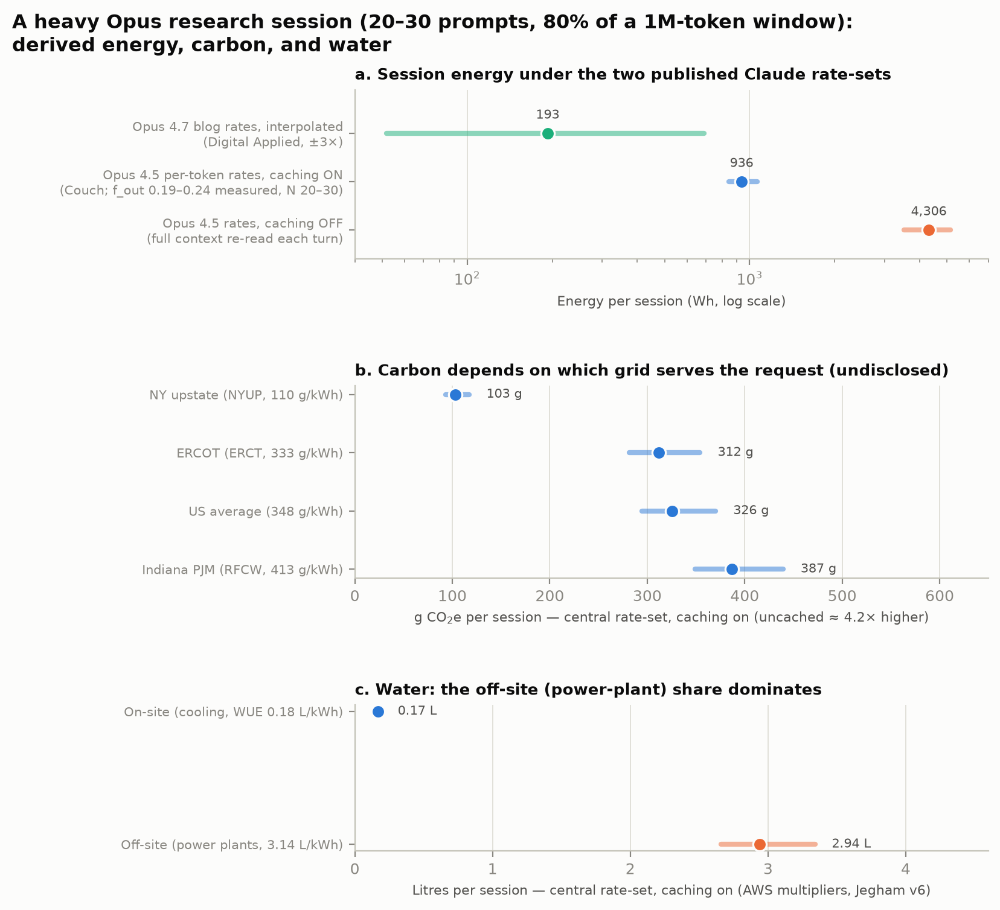

\setcounter{section}{-1}

# The bottom line

For the impatient reader: one heavy Opus research session as defined below (20–30 prompts accruing 80% of a 1M-token window) costs, under the central estimate with its parameter-sweep uncertainty:

| | Per session |
|:---|:---|
| **CO~2~** | **460 ± 160 g CO~2~e** (US-average grid) |
| **Water** | **4,400 ± 1,500 mL** total (of which **240 ± 90 mL** is on-site cooling water) |
| *underlying energy* | *1.3 ± 0.45 kWh* |

**Read the ± narrowly.** It spans only the swept scenario parameters (prompt count 20–30, output share 20–80%) at the central rate-set with caching on. It is *not* a total uncertainty. Three larger shifts sit outside it: the grid actually serving the request moves CO~2~ between ~140 g (upstate NY) and ~540 g (Indiana PJM) on annual-average accounting — and to 623–810 g across those same sites if you cost the *incremental* load at published marginal rates instead, which also compresses the spread between sites to 1.3× (Section 4); defeating prompt caching raises everything ~3.6×, to roughly 1.6 ± 0.4 kg CO~2~e and 16 ± 4 L; and the optimistic alternative rate-set sits ~7× below the central values. Section 4 audits which direction each remaining assumption is likely to be wrong in. Everything here is derived, not measured.

## In relation to what?

A number without a denominator is an invitation to misread it, so here is the central estimate against everyday personal quantities (US reference values):

| One session equals… | CO~2~: 460 g | Water: 4.4 L (240 mL on-site) |
|:---|:---|:---|
| …of your daily life | **~4.5%** of an average household's *electricity* emissions for one day (~29 kWh → ~10 kg CO~2~e); **~1.2%** of the average American's *total* daily carbon footprint (~38 kg) | **~1.4%** of one person's daily indoor water use (~310 L); about **¾ of one toilet flush** (6 L) |
| …in a familiar unit | driving an average US gasoline car **~1.1 miles / 1.8 km** (EPA: 400 g/mile) | **~9 standard 500 mL bottles** at the full (power-plant-inclusive) boundary; **about half a bottle** counting only data-center cooling |

Read across the row that matches the question being asked. If the question is "should *I* feel bad about this session?", the honest answer from these denominators is that it is a rounding error on a day's personal footprint — you emit the session's CO~2~ roughly every 17 minutes just by being an average American, and flush more water before breakfast. If the question is "does this scale?", invert it: a researcher who runs one such session every working day accrues ~110 kg CO~2~e and ~1,100 L per year, and a 10,000-person user base doing the same reaches ~1.1 ktCO~2~e/yr — at which point the grid factors and disclosure gaps of the main report, not personal restraint, are the operative variables. Both readings are correct; they answer different questions. (Reference values: EIA household electricity ~10,800 kWh/yr; Global Carbon Budget US per-capita ~14 t/yr; EPA fleet-average 400 g/mile; EPA WaterSense ~82 gal/person/day indoor; US federal standard 1.6 gal/flush. The caching-off case scales every "session" entry ~3.6×.)

# Purpose and honest framing

This brief answers a practical question for researchers: *if I use an Opus-class Claude model the way researchers actually do — long conversations, big contexts, papers pasted in — how much electricity, water, and CO~2~ does that represent?* It is a companion to the full report, which established the evidence base; this document applies that base to one concrete scenario.

One framing rule matters more than any number below. **Anthropic has published no measured energy, water, or carbon figures, so everything here is derived from third-party per-token estimates.** Unlike the main report's figures — which plot only published values — this brief exists precisely to do the arithmetic a researcher can't avoid doing. Every assumption is stated, every rate is sourced, and the result is presented as a range whose width is honest: about **two orders of magnitude between the most optimistic and most pessimistic defensible readings**, with a central estimate we consider most plausible. If a reader takes away one number, it should be the central estimate; if they take away two, the second should be the width of the range.

# The scenario

The use-case, per the project brief: a researcher working through a substantial problem sends **20–30 prompts** in one conversation and accrues **80% of a 1-million-token context window (800,000 tokens)** with an Opus-class model. Naively, each prompt contributes an equal share of the window. We take N = 25 prompts as the central case, so each turn adds ~32,000 tokens (a chunk of a paper, a long reply, a data excerpt) and the model's context grows linearly from 32k to 800k tokens over the session.

Two mechanical facts drive everything. First, in an accumulating conversation the model re-reads the entire history on every turn, so the *processed* token count is far larger than the window: with equal steps, total history re-read is 800k × (N−1)/2 ≈ **9.6 million tokens** for N = 25, on top of the 800k of new content. Second, whether those re-read tokens are cheap or expensive depends on **prompt caching**: Anthropic's serving stack caches conversation prefixes, and the one published Claude rate-set that distinguishes these prices caching at roughly one-tenth the energy of fresh input. Caching state is therefore the single largest lever in the result, and we show both cases.

Because the model must be one for which published rates exist, the calculation uses **Opus 4.5-generation rates** (and an Opus 4.7 alternative). Under the strict rule of the main report there is no published basis for the Fable/Claude 5 generation; a reader using newer models should treat these numbers as the best available proxy, biased in an unknown direction, though the industry's measured trend (33× per-prompt energy reduction in one year at Google; ~40% per-token annual software gains in ML.ENERGY data) suggests newer serving stacks are more efficient per token, while newer models may think longer.

## Rates and assumptions

Table: Inputs. Rates are published third-party estimates; scenario parameters are this brief's assumptions.

| Quantity | Value | Source / status |
|:---|:---|:---|
| Fresh input energy | 390 Wh / M tokens | Couch (Jan 2026), Opus 4.5 via price-ratio scaling of Epoch's GPT-4o anchor |
| Output energy | 1,950 Wh / M tokens | same |
| Cached-read energy | 39 Wh / M tokens | same |
| Alternative per-request rates | 0.78 Wh (short chat) → 14.1 Wh (800k context) | Digital Applied (Apr 2026), Opus 4.7, ±3× self-declared |
| On-site water | 0.18 L / kWh | AWS multiplier used by Jegham et al. v6 |
| Off-site (power-plant) water | 3.142 L / kWh | same |
| Grid carbon intensity | 110–413 gCO~2~/kWh | EPA eGRID 2023: NYUP, ERCT (333), US avg (348), RFCW |
| Prompts per session (N) | 20–30, central 25 | scenario assumption |
| Window accrued | 800k tokens (80% of 1M) | scenario assumption |
| Output share of window (f) | 0.2–0.8, central 0.5 | scenario assumption (unmeasured) |
| Caching | on (central) / off (bound) | Anthropic serving default is on; not verifiable externally |

The output-share parameter deserves one sentence: the 800k window contains both what you paste in and what the model writes back, and output tokens cost ~5× fresh input per token under these rates; since no one has measured the input/output mix of research conversations, we sweep 20–80% and center at 50%.

# Results

Table: Session totals (central case: N = 25, f = 0.5, caching on; ranges span N = 20–30 and f = 0.2–0.8). All values derived.

| Metric | Central | Range (caching on) | Caching off | Optimistic alt. (Opus 4.7 interp.) |
|:---|---:|---:|---:|---:|
| Energy / session | **1.31 kWh** | 0.86–1.76 kWh | 3.5–5.8 kWh | 0.05–0.69 kWh (central 0.19) |
| Energy / prompt | 52 Wh | 34–80 Wh | 170–214 Wh | 3–23 Wh |
| CO~2~e / session, US-avg grid | **456 g** | 299–614 g | 1.2–2.0 kg | 18–240 g |
| CO~2~e / session, Indiana PJM | 541 g | 354–728 g | 1.5–2.4 kg | 21–285 g |
| CO~2~e / session, upstate NY | 144 g | 94–194 g | 0.4–0.6 kg | 6–76 g |
| Water / session, on-site only | **0.24 L** | 0.15–0.32 L | 0.6–1.0 L | 0.01–0.12 L |
| Water / session, incl. off-site | **4.4 L** | 2.9–5.9 L | 11.7–19.4 L | 0.2–2.3 L |
| Water / prompt, incl. off-site | 174 mL | 112–267 mL | 0.6–0.7 L | 9–76 mL |

## What these numbers mean

**Energy.** The central estimate — **~1.3 kWh for the whole session** — is about a dishwasher cycle, 4–5% of an average US household's daily electricity, or the energy to drive a typical EV about 8 km. It is also roughly **5,500 median Gemini prompts**: a vivid illustration of the main report's point that heavy long-context use, not the median chat, is where individual footprints live. Per prompt, the central ~52 Wh is ~60× the Jegham short-prompt figure for Claude 3.7 Sonnet and ~200× Google's measured median — driven almost entirely by the accumulated context, not by anything exotic about the questions asked.

**Carbon.** At the US-average grid factor the central session is **~0.46 kg CO~2~e — about 1.1 miles of driving in an average US gasoline car**. Where the request is actually served changes this by ~3.8× on annual-average accounting: ~0.14 kg on upstate New York's hydro-heavy grid versus ~0.54 kg on the Indiana PJM grid hosting Anthropic's largest campus — and which grid serves *your* request is not disclosed or controllable. That siting spread narrows to ~1.3× if the same sites are costed at marginal rates (Section 4), so it is a much weaker lever than it first appears. Annualized, a researcher running one such session every working day at the central estimate emits **~100–120 kg CO~2~e/yr** (US-avg grid) — about a tenth of one transatlantic round-trip flight per economy seat, or roughly one tank of gasoline burned. Training amortization, embodied hardware, and idle capacity are *not* included; no published basis exists for adding them for Claude.

**Water.** The central session evaporates **~0.24 L on-site** (a half-glass) and **~4.4 L including power-plant water** (about eight 500 mL bottles). The viral-era claim of "a bottle of water per prompt" is, for this deliberately heavy scenario, roughly right *per three prompts* at the total boundary — and roughly 50× too high at the on-site boundary that corporate figures use. Both statements are true; they use different boundaries, which is the entire water-numbers controversy in miniature.

**The spread is the finding.** The optimistic reading (Opus 4.7 blog rates, interpolated) puts the session under 0.2 kWh; the pessimistic one (no caching, output-heavy, 30 prompts) approaches 6 kWh. That ~30× spread between defensible constructions — before grid choice and accounting convention move carbon by another ~2.3× (Section 4) — is the direct, practical cost of Anthropic's non-disclosure documented in the main report.

# Which way are we wrong?

Presenting a central estimate obliges us to say which direction it is likely to be off in. Two things need separating: a *grid-accounting* choice we made that has a defensible alternative in each direction, and a set of *boundary exclusions* that are almost all one-directional.

## Marginal vs. average grid intensity

The table above converts electricity to CO~2~ using eGRID **annual average** factors — the emissions intensity of everything on that grid over a year. But adding a data center's load does not draw down "the average"; grid operators dispatch generators in merit order, and the unit that actually responds to incremental demand is usually gas or coal, not the must-run nuclear and renewables that pull the average down. The technically correct factor for an *incremental* load is a marginal one, and there are two of those, pointing opposite ways.

**Short-run marginal** (SRMER) asks which existing plant ramps up tonight, and is consistently *higher* than the average. PJM's own published rates put its 2022 marginal at 976 lb/MWh off-peak and 1,041 on-peak against an 811 lb/MWh system average; weighting those by the hours a flat 24/7 load actually occupies (on-peak is 80 of 168 hours per week) gives 1,007 lb/MWh, or **1.24×** the system average. EPA's AVERT, run for data year 2023, puts the national flat-profile ("uniform EE") marginal rate at 1,429 lb/MWh against eGRID 2023's 767 lb/MWh US average — **1.86×**, the largest ratio in this literature. Holland et al. (PNAS 2022) find **1.51×** nationally — and, pointedly, that while average US emissions fell 28% over 2010–2019, *marginal* emissions rose 7%.

Those are national stand-ins. AVERT also publishes rates per region, which lets the sites hosting Anthropic's compute be costed against the grids that actually serve them — and doing so produces the most consequential result in this section. On eGRID annual averages, the fleet spans a factor of 3.8, from upstate New York's hydro-heavy 110 gCO~2~/kWh to Indiana PJM's 413. On AVERT's 2023 marginal rates the same three regions span only **475 (New York), 587 (Texas), and 618 (Mid-Atlantic) gCO~2~/kWh — a factor of 1.3.** The siting advantage that dominates the attributional picture very largely disappears at the margin, because the unit that responds to an incremental gigawatt is a gas turbine in all three places, whatever the annual average mix looks like. A reader tempted to conclude "route my inference to the clean grid" should note that this is a claim about attributional accounting, not about the molecules emitted in response to the request.

Three cautions on those regional numbers, all pushing toward reading them as indicative rather than exact. AVERT's regions are aggregations of balancing authorities and are **not coextensive with eGRID's subregions**, so each ratio crosses a boundary; the New York case is the worst, because AVERT's New York region spans all of NYISO including gas-heavy downstate while eGRID's NYUP is upstate only, which means the headline 4.3× ratio there is part marginal effect and part geographic mismatch. Indiana is split 21% Mid-Atlantic / 79% Midwest in EPA's apportionment; New Carlisle is assigned to Mid-Atlantic here because its utility, Indiana Michigan Power, is a PJM member. And AVERT's rates are T&D-loss adjusted for retail-level loads, which makes them modestly high for a transmission-connected campus. Note also that AVERT's Mid-Atlantic marginal rate (618 gCO~2~/kWh) and PJM's own flat-weighted 2022 marginal rate (457) differ by a third for substantially the same footprint — different method, different data year, and the T&D adjustment. Where two authoritative sources for one quantity disagree that much, the honest move is to print both rather than pick.

One further caveat is EPA's own. The AVERT documentation states that the tool "is a marginal emissions assessment tool and not a tool for emissions accounting," and cautions specifically against using its rates in corporate greenhouse-gas reporting. That is consistent with how they are used here — as a sensitivity on an attributional headline, not as a replacement for it.

**Long-run marginal** (LRMER) asks what gets *built* because sustained new demand exists, and can be *lower* than the average: Gagnon & Cole (PNAS 2022) argue short-run rates "neglect the impacts of any structural change," and for US vehicle electrification found LRMERs of 286–336 gCO~2~/kWh against short-run rates of 591–631 — a factor-of-two disagreement in the opposite direction, because new load in most US markets induces disproportionately renewable build.

Table: The central session (1.31 kWh) costed under each grid-accounting convention. Derived; conventions are not interchangeable.

| Convention | Factor (gCO~2~/kWh) | Session CO~2~ | Source |
|:---|---:|---:|:---|
| Long-run marginal (build margin) | 286–336 | **375–440 g** | Gagnon & Cole, PNAS 2022 (US EV study — direction, not a data-center factor) |
| eGRID average, US | 348 | 456 g | EPA eGRID 2023 (this brief's headline) |
| eGRID average, Indiana PJM (RFCW) | 413 | 541 g | EPA eGRID 2023 |
| Short-run marginal, PJM published (2022) | 443–472 | 580–618 g | PJM 2018–2022 Emission Rates report |
| Short-run marginal, AVERT New York (2023) | 475 | 623 g | EPA AVERT — serves Lake Mariner, NY |
| Short-run marginal, AVERT Texas (2023) | 587 | 769 g | EPA AVERT — serves Barber Lake / Abernathy |
| Short-run marginal, AVERT Mid-Atlantic (2023) | 618 | 810 g | EPA AVERT — serves New Carlisle, IN |
| Short-run marginal, US national | 591–648 | 774–849 g | Gagnon & Cole PNAS 2022; EPA AVERT 2023 |

So the defensible band for the same session is roughly **375–850 g CO~2~e** — about 2.3×, on top of everything else. The three AVERT rows are the ones matched to grids that actually host Anthropic compute, and all three sit above every attributional row in the table. Our headline sits near the middle, which we think is the right default: LRMER's optimism rests on new load inducing clean build, and for AI data centers specifically the documented 2025–26 responses have included coal-retirement deferrals, multi-year gas-turbine backlogs, and on-site gas generation, which is not what that assumption describes. But a reader who wants the incremental-emissions number rather than the attributional one should use the short-run rows, and they are higher than what we printed. The same dispatch logic governs the off-site water: a marginal gas or coal unit evaporates cooling water, wind and solar do not, so the 4.2 L off-site figure inherits this uncertainty too — we found no published marginal water-intensity factors to quantify it.

## Direction of the excluded terms

Table: Every term we left out or approximated, and which way it moves the answer.

| Term | Status | Direction | Magnitude if known |
|:---|:---|:---|:---|
| Idle capacity, host CPU/DRAM, PUE | likely outside the Couch/Epoch boundary | **↑ understates** | up to ~2.4× (Google: 0.10 → 0.24 Wh chip-only vs full boundary) |
| Training, amortized per prompt | excluded | **↑** | unknown for Claude; Google's historical ML split was ~60/40 inference/training |
| Embodied carbon (chips, buildings) | excluded | **↑** | only Mistral has quantified it for any frontier model |
| Chip-fabrication water | excluded | **↑** | ~2,200 gal ultra-pure water per chip (Ren) |
| Extended thinking / reasoning modes | excluded | **↑** if you use them | 3–4× on affected requests (Jegham) |
| Short-run marginal grid intensity | we used annual average | **↑** | 1.24–1.86× (1.5× at the AVERT region serving New Carlisle) |
| Price-as-energy-proxy in the Couch rates | assumption | **↓ overstates** if Opus pricing carries margin above marginal compute | unquantified |
| Model/serving vintage (Opus 4.5-era rates) | proxy for newer models | **↓** | industry trend is fast: 33× per-prompt in 12 months at Google; ~40%/yr per-token from software alone |
| Long-run marginal grid intensity | we used annual average | **↓** | 0.7–0.8× |
| Equal-prompt-size, caching behaviour, output share | simplifications | ambiguous | inside the printed ± |

We cannot sign the net error, and we are not going to pretend otherwise. What can be said cleanly is that the *boundary* exclusions are systematically one-directional — every physical thing we left out of the accounting adds emissions and water rather than removing them — while the terms that plausibly push down are about *method vintage and pricing assumptions* rather than about physical processes we ignored. A reader who wants a single defensible sentence: the central estimate is more likely to be too low than too high on boundary grounds, and the honest total uncertainty is roughly an order of magnitude, not the ±35% printed in Section 0.

# How a researcher can actually reduce this

The scaling structure behind these numbers implies concrete, high-leverage habits, in descending order of effect. **Start new conversations rather than extending old ones** when the history no longer matters: the 9.6M re-read tokens are the largest single line item, and a fresh thread resets it (this is also why the caching-off column is ~3.6× worse — if you use an interface or API pattern that defeats caching, the history dominates everything). **Trim what you paste**: attaching only the relevant sections of papers rather than full PDFs attacks the supra-linear prefill term documented in the main report (~0.3 Wh at short context versus ~40 Wh modeled at 100k input tokens). **Prefer concise outputs** where possible: output tokens carry ~5× the per-token cost of fresh input under these rates, so asking for a targeted answer rather than an exhaustive rewrite matters more than shortening your question. **Match the model to the task**: routing summarization or extraction to a smaller model and reserving Opus-class reasoning for the hard steps tracks the 10–30× per-token spread between model classes in the measured open-model literature. And for perspective, keep the denominator honest in both directions: one heavy session is a dishwasher cycle, not a catastrophe — but a lab of twenty researchers doing this daily is ~7 MWh/yr, the scale at which grid siting, disclosure, and procurement (the main report's Sections 3 and 8) become the real environmental questions.

# Caveats register

Everything above is **derived, not measured**. The Couch rates rest on an untested assumption (API price tracks marginal compute energy) anchored to a GPT-4o estimate on assumed NVIDIA hardware, while Claude actually serves substantially on Trainium and TPUs with unpublished power characteristics. The caching-on column assumes Anthropic's prefix caching works across your whole session; the equal-prompt-size assumption is the user's stated simplification (front-loaded contexts — pasting everything in turn one — would shift cost from history re-reads toward a single large prefill and lower totals modestly under cached rates); the output-share is unmeasured; extended-thinking modes are *excluded* (Jegham's measurements suggest 3–4× multipliers on affected requests); and no training, embodied-hardware, idle-capacity, or chip-fabrication water is included anywhere. The grid factors are 2023 annual averages, not marginal or hourly intensities — Section 4 quantifies that choice rather than merely flagging it. Where these caveats resolve — if Anthropic publishes measured per-token distributions, fleet PUE/WUE, and site attribution — this entire brief reduces to one row of a disclosed table. Until then, cite these numbers with their ranges attached.

# Sources

Rates and factors: Couch, *Electricity use of AI coding agents* (simonpcouch.com, Jan 2026) · Digital Applied, *AI Model Sustainability Report 2026* (Apr 2026) · Jegham et al., arXiv:2505.09598 v6 (AWS PUE/WUE/CIF multipliers) · EPA eGRID 2023 Rev 2 · Google, arXiv:2508.15734 (Gemini median, efficiency trend) · Epoch AI gradient update (context scaling) · ML.ENERGY leaderboard & longitudinal data (model-class spreads, caching-era software gains). Marginal-emissions sensitivity (Section 4): PJM, *2018–2022 CO~2~, SO~2~ and NO~X~ Emission Rates* (Apr 2023), Table 2, values read from the report directly — this remains the most recent edition, as PJM discontinued the annual PDF thereafter in favour of Data Miner and its interactive Emissions page · EPA, *Emission Rates from AVERT* (Apr 2024 release, data year 2023), national and regional "uniform EE" avoided CO~2~ rates, extracted by `extract_avert.py` · Holland, Kotchen et al., "Why marginal CO~2~ emissions are not decreasing for US electricity," *PNAS* 2022 · Gagnon & Cole, "Short-run marginal emission rates omit important impacts of electric-sector interventions," *PNAS* 2022, and NREL Cambium LRMER data · Siler-Evans, Azevedo & Morgan, *Environ. Sci. Technol.* 2012. Everyday reference values (Section 0): EIA, average US residential electricity consumption (~10,800 kWh/household/yr) · Global Carbon Project / Our World in Data, US per-capita CO~2~ (~14 t/yr) · EPA, average passenger-vehicle emissions (400 g CO~2~/mile) · EPA WaterSense, indoor water use (~82 gal/person/day) · US Energy Policy Act 1992 toilet standard (1.6 gal/flush). Full source list and credibility assessments: *The Environmental Footprint of Claude* (companion report, Appendix B), and `sourced_data.json` for machine-readable values. Scenario arithmetic: `scenario_calc.py`, reproducible.
